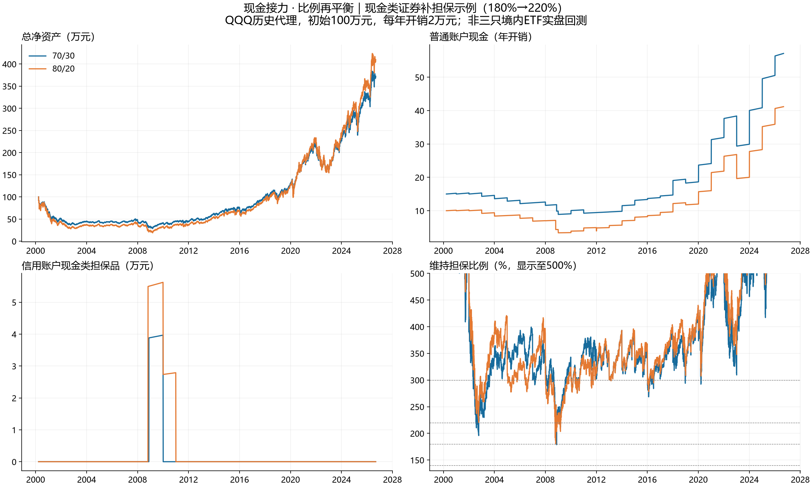

# 70/30与80/20现金接力：现金类证券补担保对比

研究日期：2026-09-12。金额按初始100万元归一化；2万元等于一年开销。

**结论：80/20提高股票敞口，也减少可供生活与补担保共用的现金。补担保改善信用账户维持率，但不创造净资产，也不保证普通账户始终有钱生活。**

## 已确认的规则与本次假设

- 采用用户向国信客户经理确认的当前条件：长期挂息、未付利息不计息、维持率高于140%可以展期。140%同时保留为研究停止线；不把它称为已核实的国信强平线，也不推定政策永不变化。
- 每年生活费固定为初始资产2%；利率沿用2.8%单利。70/30买股现金底线15年开销，80/20底线10年。只用高于底线的部分补仓，卖股补现金不受该底线限制。
- 配比按股票市值÷总资产计算，负债另列。总资产含普通、信用与在途资产，净资产=总资产−本金−未付利息。80/20并不保证股票÷净资产仅为80%。
- 融资生活仍通过融资买股、转出等值自有股票、普通账户卖出实现；同时检查可转自有股票、保证金余额和操作后300%维持率。暂停后满足条件可以恢复，逐年记录是否实际融资。
- 根据用户最新确认，补担保可以用尽全部普通现金；再平衡的15/10年底线不限制救险。主版本在普通账户买现金类证券再划转，信用内不卖出、不主动还本付息。b、c不是自动兜底：否则会把“零还款失败”伪装成成功。
- 主版本现金类证券假设总收益年化2%、无价格波动、收益留在证券中、担保折算率90%，与普通现金同收益。它是抽象资产，不代表某只ETF的净值、分红或国信资格已核实；原始信用现金收益为0。
- 补担保触发参数未确定，比较160→200、180→220、200→240三组百分比。逐年明细以180→220为示例，不能据此认定为最优参数。
- 开盘与收盘观察并发起补担保，默认下一交易日到账；在途资产不计信用维持率。日内最低价跌破140%立即记研究风险失败，不假装能在该最低价成交补救。风险操作是年度例行操作之外的例外。
- 补担保后信用现金类证券可留存。作为明确的测试假设，每年例行操作时先将合法可转出的现金类担保品退回普通账户，再考虑卖股；转出后至少300%，保证金余额非负。另测试不退回版本。
- 默认现金已可购买证券；银行理财须先赎回，额外等待通过0/3/5交易日补担保延迟分支测试。此简化未模拟节假日错配或产品暂停赎回。

## 主历史路径

2000-03-27至2026-09-08，QQQ复权日线代理。沿用既有数据，未把159501、513100、159696拼接为2000年可交易产品。未计人民币汇率、境内ETF溢折价、实际费税、不同交易时段和基金跟踪差异。现金为平滑收益假设。2000与2026是不完整年度，但各支取全年2万元，合计27笔。

| 方案 | 期末净资产/万元 | 最低维持率 | 普通现金最低/年 | 净资产最大回撤 | 融资年数 | 补担保累计/万元 | 还本/付息/万元 |
| --- | --- | --- | --- | --- | --- | --- | --- |
| 70/30 不补担保 | 372.39 | 166.72% | 9.25 | 71.58% | 18 | 0.00 | 0.00 / 0.00 |
| 70/30 现金类证券：180→220 | 372.39 | 178.32% | 8.89 | 71.58% | 18 | 3.88 | 0.00 / 0.00 |
| 80/20 不补担保 | 409.73 | 152.76% | 3.93 | 81.16% | 19 | 0.00 | 0.00 / 0.00 |
| 80/20 现金类证券：180→220 | 409.73 | 171.61% | 3.37 | 81.16% | 19 | 5.49 | 0.00 / 0.00 |

最大回撤根据扣除生活支出后的账户净资产日终序列计算，含支出影响；不是时间加权投资收益的回撤。最低维持率还包含日内最低价观察，因此不一定落在图示的收盘曲线上。补担保累计是历次转入之和，可能包含后续转出再转入，不等于永久占用。

本条历史路径中，同一配比的证券补担保与不补担保期末净资产恰好相同：移入移出不改变总资产，两处现金类收益相同，担保品随后退回且未改变年度股票买卖和融资结果。这不是普遍结论；普通现金枯竭、担保品收益差异或长期不能退回都会改变结果。

## 触发阈值敏感性

| 配比 | 触发→目标 | 期末净资产/万元 | 最低维持率 | 最低普通现金/年 | 累计补担保/万元 | 失败 |
| --- | --- | --- | --- | --- | --- | --- |
| 70 | 现金类证券：180→220 | 372.39 | 178.32% | 8.89 | 3.88 | 无 |
| 70 | 现金类证券：160→200 | 372.39 | 166.72% | 9.25 | 0.00 | 无 |
| 70 | 现金类证券：200→240 | 372.39 | 187.29% | 8.39 | 7.46 | 无 |
| 80 | 现金类证券：180→220 | 409.73 | 171.61% | 3.37 | 5.49 | 无 |
| 80 | 现金类证券：160→200 | 409.73 | 155.33% | 3.57 | 5.11 | 无 |
| 80 | 现金类证券：200→240 | 409.73 | 195.61% | 1.25 | 9.73 | 无 |

## 三种救险方式的效率

设信用资产A、负债D，动用相同金额x，不考虑价格波动和费用：

- a 补入担保品：(A+x)/D。现金类证券按当时市值进入维持率分子，折算率作用于保证金可用余额，不能把两种指标混用。
- b 普通现金还款：A/(D−x)。
- c 信用卖券还款：(A−x)/(D−x)。

当A>D、0<x<D时，b的维持率提升大于a和c；a与c没有固定顺序，c优于a当且仅当A/D>2−x/D。小额操作时，约以200%为分界。你的a优先，体现的是保留负债与股票的目标，不是每元资金提升维持率最多。

例如信用资产180万元、负债100万元，要达到220%：a需补40万元；b需还18.18万元；c需卖券还33.33万元。若将全部可用普通现金先用于a，b将没有普通现金可用；再启动还款必须明确允许动用已转入的担保品，或预先保留还款资金。

本次主版本坚持a且不主动还款，耗尽现金或触及风险线即报告失败。b/c属于改变目标后的救险分支，没有自动混入结果。

## 多起点滚动检查

按每季度首个可用交易日起投，分别持有10年、20年；相同起点成对比较，窗口重叠，样本失败率不能解释为未来失败概率。

| 方案 | 持有年数 | 窗口数 | 失败数 | 跨窗口最低维持率 | 跨窗口最低普通现金/年 |
| --- | --- | --- | --- | --- | --- |
| 70_none | 10 | 71 | 0 | 152.05% | 11.14 |
| 80_none | 10 | 71 | 0 | 147.01% | 6.34 |
| 70_a180 | 10 | 71 | 0 | 170.83% | 9.20 |
| 80_a180 | 10 | 71 | 0 | 167.97% | 3.64 |
| 70_none | 20 | 31 | 0 | 152.05% | 9.57 |
| 80_none | 20 | 31 | 0 | 147.01% | 4.72 |
| 70_a180 | 20 | 31 | 0 | 170.83% | 9.20 |
| 80_a180 | 20 | 31 | 0 | 167.97% | 3.64 |

## 压力路径

额外跌幅和40年平滑价格均为人为反例，不是发生概率或市场预测。失败时净资产可能仍为正，信用安全与生活流动性必须分开判断。

| 情景 | 配比 | 停止/期末日期 | 状态 | 净资产/万元 | 普通现金/年 | 信用现金类担保/万元 |
| --- | --- | --- | --- | --- | --- | --- |
| 2008-11-20起额外永久跌20% | 70 | 2026-09-08 | 完成 | 284.27 | 44.01 | 0.00 |
| 融资利率6% | 70 | 2026-09-08 | 完成 | 331.06 | 51.48 | 0.00 |
| 现金类收益0% | 70 | 2026-09-08 | 完成 | 279.58 | 43.02 | 0.00 |
| 年开销每年增长2% | 70 | 2026-09-08 | 完成 | 300.19 | 47.53 | 0.00 |
| 人工路径：40年价格不变 | 70 | 2030-01-03 | LiquidityFailure | 38.91 | 0.62 | 0.00 |
| 人工路径：前10年每年跌5%、后30年涨5% | 70 | 2039-12-30 | 完成 | 95.85 | 17.92 | 0.00 |
| 2008-11-20起额外永久跌20% | 80 | 2026-09-08 | 完成 | 307.19 | 31.28 | 0.00 |
| 融资利率6% | 80 | 2026-09-08 | 完成 | 360.48 | 36.99 | 0.00 |
| 现金类收益0% | 80 | 2026-09-08 | 完成 | 352.41 | 35.41 | 0.00 |
| 年开销每年增长2% | 80 | 2026-09-08 | 完成 | 300.37 | 31.28 | 0.00 |
| 人工路径：40年价格不变 | 80 | 2023-01-04 | LiquidityFailure | 49.50 | 0.84 | 0.00 |
| 人工路径：前10年每年跌5%、后30年涨5% | 80 | 2039-12-30 | 完成 | 95.88 | 12.53 | 0.00 |
| 2008-11-20起额外永久跌40% | 70 | 2026-09-08 | 完成 | 204.13 | 32.09 | 0.00 |
| 2008-11-20起额外永久跌40% | 80 | 2009-01-06 | LiquidityFailure | 15.90 | 0.00 | 14.26 |

上表“普通现金/年”统一按初始2万元为展示单位；通胀情景的实际剩余生活年数更少。MarginFailure表示触及研究140%停止线；LiquidityFailure表示到期无法支付生活费；ContractFailure表示展期条件不满足。

## 自动扣息、流动性与担保品退回

国信公开旧版手册说明信用账户可用现金会优先偿还已结算未付利息。这并不否定用户确认的长期单利挂息。本次将“原始现金自动扣息”作为不同合约行为对照，按每月首个交易日结息、日终现金优先支付已结算利息，不还本金。

| 配比 | 分支 | 期末净资产/万元 | 累计付息/万元 | 最低普通现金/年 |
| --- | --- | --- | --- | --- |
| 70 | 现金类证券：180→220 | 372.39 | 0.00 | 8.89 |
| 70 | 原始现金：自动扣息 | 360.73 | 1.65 | 8.56 |
| 80 | 现金类证券：180→220 | 409.73 | 0.00 | 3.37 |
| 80 | 原始现金：自动扣息 | 409.15 | 1.87 | 3.37 |

现金类证券主版本与原始现金分支同时存在收益2%与0%的差异，表中净资产差异不能全部归因于扣息。现金类ETF也未必不派现；必须确认具体产品的收益分配方式、国信可充抵资格及折算率。“可两融”本身不等于低风险现金资产。

| 分支 | 期末净资产/万元 | 最低维持率 | 最低普通现金/年 | 状态 |
| --- | --- | --- | --- | --- |
| 70_a180_delay0 | 372.39 | 178.32% | 8.89 | 完成 |
| 70_a180_delay3 | 372.39 | 166.72% | 8.48 | 完成 |
| 70_a180_delay5 | 372.39 | 166.72% | 8.48 | 完成 |
| 70_a180_no_return | 375.42 | 178.32% | 7.40 | 完成 |
| 80_a180_delay0 | 409.73 | 172.47% | 3.37 | 完成 |
| 80_a180_delay3 | 409.73 | 171.61% | 3.37 | 完成 |
| 80_a180_delay5 | 409.73 | 171.61% | 3.37 | 完成 |
| 80_a180_no_return | 425.02 | 171.61% | 1.55 | 完成 |

## 逐年双账户明细

单位万元；“信用现金类”在主版本中全部为证券市值，非可用现金。普通账户转入救险后不再拥有同一份现金。期末净资产包含少量可能在途资产；完整记录另列在途、股票损益、现金收益、利息费用、支出和逐年对账差额。最低维持率为该年日内观察最低值，非年末值。最后一年截至2026-09-08。

### 70/30：180%补到220%示例

| 年 | 融资 | 普通现金 | 信用股票 | 信用现金类 | 本金 | 未付息 | 年末维持率 | 年内最低 | 净资产 | 补担保/退回 |
| --- | --- | --- | --- | --- | --- | --- | --- | --- | --- | --- |
| 2000 | 是 | 30.44 | 34.70 | 0.00 | 2.00 | 0.04 | 1699.04% | 1579.92% | 63.10 | 0.00/0.00 |
| 2001 | 是 | 30.59 | 23.28 | 0.00 | 4.00 | 0.15 | 560.32% | 394.63% | 49.72 | 0.00/0.00 |
| 2002 | 是 | 30.59 | 14.95 | 0.00 | 6.00 | 0.32 | 236.47% | 192.92% | 39.22 | 0.00/0.00 |
| 2003 | 否 | 29.17 | 22.38 | 0.00 | 6.00 | 0.49 | 344.76% | 225.56% | 45.05 | 0.00/0.00 |
| 2004 | 否 | 27.71 | 24.73 | 0.00 | 6.00 | 0.66 | 371.45% | 301.07% | 45.79 | 0.00/0.00 |
| 2005 | 否 | 26.22 | 25.12 | 0.00 | 6.00 | 0.83 | 368.00% | 317.01% | 44.52 | 0.00/0.00 |
| 2006 | 否 | 24.71 | 26.92 | 0.00 | 6.00 | 0.99 | 384.85% | 319.79% | 44.63 | 0.00/0.00 |
| 2007 | 是 | 25.20 | 32.04 | 0.00 | 8.00 | 1.22 | 347.54% | 290.36% | 48.02 | 0.00/0.00 |
| 2008 | 否 | 19.77 | 18.67 | 3.89 | 8.00 | 1.44 | 238.90% | 178.32% | 32.89 | 3.88/0.00 |
| 2009 | 否 | 18.13 | 28.88 | 3.97 | 8.00 | 1.67 | 339.77% | 210.80% | 41.31 | 0.00/0.00 |
| 2010 | 否 | 20.50 | 34.69 | 0.00 | 8.00 | 1.89 | 350.78% | 270.96% | 45.30 | 0.00/3.97 |
| 2011 | 否 | 18.87 | 35.90 | 0.00 | 8.00 | 2.11 | 354.95% | 318.41% | 44.65 | 0.00/0.00 |
| 2012 | 是 | 19.24 | 42.40 | 0.00 | 10.00 | 2.40 | 342.09% | 300.15% | 49.25 | 0.00/0.00 |
| 2013 | 是 | 19.64 | 57.94 | 0.00 | 12.00 | 2.73 | 393.31% | 297.24% | 62.85 | 0.00/0.00 |
| 2014 | 是 | 23.47 | 64.97 | 0.00 | 14.00 | 3.12 | 379.44% | 308.40% | 71.32 | 0.00/0.00 |
| 2015 | 是 | 26.70 | 68.03 | 0.00 | 16.00 | 3.57 | 347.64% | 264.05% | 75.17 | 0.00/0.00 |
| 2016 | 是 | 27.85 | 72.20 | 0.00 | 18.00 | 4.07 | 327.09% | 264.33% | 77.97 | 0.00/0.00 |
| 2017 | 是 | 29.37 | 94.55 | 0.00 | 20.00 | 4.63 | 383.87% | 300.00% | 99.30 | 0.00/0.00 |
| 2018 | 是 | 38.85 | 86.05 | 0.00 | 22.00 | 5.25 | 315.77% | 293.79% | 97.64 | 0.00/0.00 |
| 2019 | 否 | 37.27 | 120.00 | 0.00 | 22.00 | 5.87 | 430.64% | 305.95% | 129.41 | 0.00/0.00 |
| 2020 | 是 | 48.24 | 163.40 | 0.00 | 24.00 | 6.54 | 535.06% | 285.14% | 181.11 | 0.00/0.00 |
| 2021 | 是 | 63.81 | 189.70 | 0.00 | 26.00 | 7.27 | 570.22% | 432.08% | 220.24 | 0.00/0.00 |
| 2022 | 是 | 76.73 | 119.90 | 0.00 | 28.00 | 8.05 | 332.61% | 318.32% | 160.58 | 0.00/0.00 |
| 2023 | 是 | 59.84 | 213.86 | 0.00 | 30.00 | 8.89 | 549.98% | 309.08% | 234.82 | 0.00/0.00 |
| 2024 | 是 | 81.65 | 242.32 | 0.00 | 32.00 | 9.79 | 579.89% | 455.44% | 282.18 | 0.00/0.00 |
| 2025 | 是 | 101.02 | 272.22 | 0.00 | 34.00 | 10.74 | 608.45% | 403.44% | 328.50 | 0.00/0.00 |
| 2026 | 是 | 114.21 | 305.61 | 0.00 | 36.00 | 11.43 | 644.29% | 502.51% | 372.39 | 0.00/0.00 |

未融资年份及原因：2003：维持率不高于300%；2004：融资并转出后不足目标维持率；2005：融资并转出后不足目标维持率；2006：融资并转出后不足目标维持率；2008：融资并转出后不足目标维持率；2009：维持率不高于300%；2010：融资并转出后不足目标维持率；2011：融资并转出后不足目标维持率；2019：融资并转出后不足目标维持率。

### 80/20：180%补到220%示例

| 年 | 融资 | 普通现金 | 信用股票 | 信用现金类 | 本金 | 未付息 | 年末维持率 | 年内最低 | 净资产 | 补担保/退回 |
| --- | --- | --- | --- | --- | --- | --- | --- | --- | --- | --- |
| 2000 | 是 | 20.29 | 39.66 | 0.00 | 2.00 | 0.04 | 1941.75% | 1805.63% | 57.91 | 0.00/0.00 |
| 2001 | 是 | 20.40 | 26.49 | 0.00 | 4.00 | 0.15 | 637.51% | 449.00% | 42.73 | 0.00/0.00 |
| 2002 | 是 | 20.40 | 16.84 | 0.00 | 6.00 | 0.32 | 266.40% | 217.33% | 30.92 | 0.00/0.00 |
| 2003 | 否 | 18.76 | 25.21 | 0.00 | 6.00 | 0.49 | 388.40% | 254.11% | 37.48 | 0.00/0.00 |
| 2004 | 否 | 17.10 | 27.86 | 0.00 | 6.00 | 0.66 | 418.46% | 339.18% | 38.31 | 0.00/0.00 |
| 2005 | 是 | 17.42 | 28.30 | 0.00 | 8.00 | 0.88 | 318.64% | 274.60% | 36.84 | 0.00/0.00 |
| 2006 | 否 | 15.73 | 30.32 | 0.00 | 8.00 | 1.10 | 333.03% | 276.80% | 36.95 | 0.00/0.00 |
| 2007 | 否 | 14.01 | 36.09 | 0.00 | 8.00 | 1.33 | 386.83% | 323.10% | 40.77 | 0.00/0.00 |
| 2008 | 是 | 8.74 | 21.03 | 5.51 | 10.00 | 1.61 | 228.63% | 171.61% | 23.67 | 5.49/0.00 |
| 2009 | 否 | 6.87 | 32.53 | 5.62 | 10.00 | 1.89 | 320.90% | 202.86% | 33.14 | 0.00/0.00 |
| 2010 | 否 | 7.92 | 39.09 | 2.79 | 10.00 | 2.17 | 344.07% | 271.08% | 37.62 | 0.00/2.89 |
| 2011 | 否 | 9.85 | 39.48 | 0.00 | 10.00 | 2.45 | 317.13% | 284.52% | 36.89 | 0.00/2.79 |
| 2012 | 否 | 9.85 | 44.58 | 0.00 | 10.00 | 2.73 | 350.12% | 308.29% | 41.69 | 0.00/0.00 |
| 2013 | 是 | 11.34 | 59.22 | 0.00 | 12.00 | 3.07 | 393.06% | 296.92% | 55.49 | 0.00/0.00 |
| 2014 | 是 | 14.21 | 67.44 | 0.00 | 14.00 | 3.46 | 386.26% | 313.85% | 64.19 | 0.00/0.00 |
| 2015 | 是 | 16.41 | 71.67 | 0.00 | 16.00 | 3.91 | 360.03% | 273.43% | 68.17 | 0.00/0.00 |
| 2016 | 是 | 17.38 | 76.06 | 0.00 | 18.00 | 4.41 | 339.40% | 274.20% | 71.02 | 0.00/0.00 |
| 2017 | 是 | 19.28 | 98.93 | 0.00 | 20.00 | 4.97 | 396.22% | 309.56% | 93.24 | 0.00/0.00 |
| 2018 | 是 | 24.76 | 94.01 | 0.00 | 22.00 | 5.59 | 340.78% | 317.06% | 91.18 | 0.00/0.00 |
| 2019 | 是 | 23.99 | 132.41 | 0.00 | 24.00 | 6.26 | 437.59% | 307.86% | 126.14 | 0.00/0.00 |
| 2020 | 是 | 31.99 | 185.69 | 0.00 | 26.00 | 6.99 | 562.91% | 300.00% | 184.70 | 0.00/0.00 |
| 2021 | 是 | 43.69 | 222.58 | 0.00 | 28.00 | 7.77 | 622.23% | 471.50% | 230.50 | 0.00/0.00 |
| 2022 | 是 | 53.66 | 143.82 | 0.00 | 30.00 | 8.61 | 372.51% | 356.51% | 158.87 | 0.00/0.00 |
| 2023 | 是 | 40.02 | 245.21 | 0.00 | 32.00 | 9.50 | 590.86% | 347.37% | 243.74 | 0.00/0.00 |
| 2024 | 是 | 56.58 | 287.87 | 0.00 | 34.00 | 10.46 | 647.47% | 508.51% | 299.99 | 0.00/0.00 |
| 2025 | 是 | 71.76 | 331.48 | 0.00 | 36.00 | 11.47 | 698.31% | 463.00% | 355.77 | 0.00/0.00 |
| 2026 | 是 | 82.33 | 377.60 | 0.00 | 38.00 | 12.20 | 752.20% | 586.65% | 409.73 | 0.00/0.00 |

未融资年份及原因：2003：维持率不高于300%；2004：融资并转出后不足目标维持率；2006：融资并转出后不足目标维持率；2007：融资并转出后不足目标维持率；2009：维持率不高于300%；2010：融资并转出后不足目标维持率；2011：融资并转出后不足目标维持率；2012：融资并转出后不足目标维持率。

## 结果可靠性的边界与下一步

优先选择参数在多种起点和压力环境下是否稳健，不以这一条历史路径的最高期末净资产选80/20。若坚持永久零还款，必须接受零还款策略可能先耗尽可花现金；净资产高或信用账户有担保品，不等于这些资产能立即转出来生活。

本次未确认具体现金类证券、实际分红与划转资格，也未回测三只境内纳指ETF的真实人民币价格。因此，这是沿用既有QQQ框架的规则对比，不是国信账户实盘可执行性的完整认证。

来源：[国信交易手册（旧版，第12页）](https://www3.guosen.com.cn/guosen/uploadfiles/_1375663786440_%E8%9E%8D%E8%B5%84%E8%9E%8D%E5%88%B8%E4%BA%A4%E6%98%93%E8%BD%AF%E4%BB%B6%E4%BD%BF%E7%94%A8%E8%AF%B4%E6%98%8E%E4%B9%A60805.pdf)；[上交所货币ETF说明](https://etf.sse.com.cn/fund/learning/knowledge/c/5704294.shtml)；[上交所标的与可充抵证券列表](https://big5.sse.com.cn/site/cht/www.sse.com.cn/services/tradingservice/margin/info/againstmargin/)。

数据与审计：results/collateral_relay保留完整配置、价格数据哈希、10套历史逐年账和日账、压力场景、滚动窗口。主版本年度净资产变动应等于股票损益+现金类收益−新增利息费用−生活支出；补担保与归还担保品不是收入或费用。
