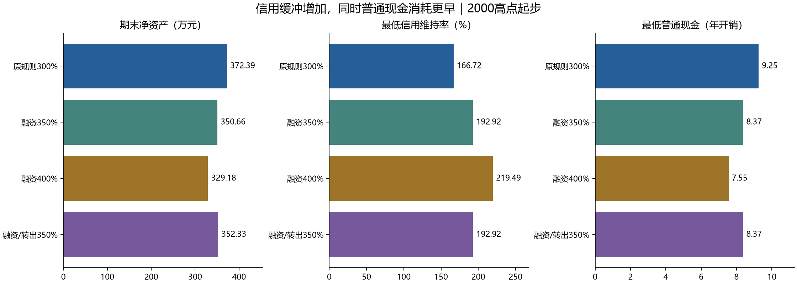

# 70/30现金接力·比例再平衡：风险审查与优化研究

审查日期：2026-09-12。保留原策略作为基线，不将优化参数替换为默认实盘指令。

## 判断

这是一条有明确现金缓冲和融资约束、值得继续研究的历史候选策略；目前还不足以认定为长期退休的可靠最优方案。优势主要来自较低的固定名义支出、普通现金与信用担保分离、熊市暂停融资及有条件再平衡。弱点是合同变化、信用账户继续下跌、生活费真实购买力、自有担保品耗尽，以及零还款规则缺少退出办法。

本次不是只列理论风险：复现原基线372.39万元，运行24个基线压力场景、5种改动各8个共同压力场景，以及6种规则×102个历史滚动窗口，共676个主要模拟。另跑无融资对照和合成路径边界修正。

## 风险一：300%是转出与新增融资门槛，并非强平保护线

原2000高点路径最低维持率166.72%；滚动窗口最差为152.05%，对应起点2000-10-02。在债务不变、信用账户只有股票的静态近似下，从该状态再下跌约7.93%就会到达本模型140%线。停止借钱不等于减少已有债务；利息继续增加分母。

计算式：冲击后维持率≈当前维持率×(1−股价跌幅)。若停借后再经历t年，单利负债增长也应计入：M≈M0×(1−跌幅)/[1+r×(本金/本息债务)×t]。这个公式说明350%也不是永久保证。

实测在2008-11-20开始对之后全部QQQ价格再乘0.8，原规则当日维持率降至135.62%，记录MarginFailure。它是“在真实熊市上再叠加20%价格冲击”的人工压力，不是声称历史上发生过这一行情。普通现金仍约23.61万元，但原规则未设计主动还款或补担保，不能自动用普通账户资产替信用账户避开失败。

## 风险二：允许挂息，不自动等于允许无限续约或永久单利

证监会规则要求合同写明利率、担保及清偿方式，展期需要评估；不是无条件到期自动续借。见[《证券公司融资融券业务管理办法》](https://www.csrc.gov.cn/csrc/c106256/c1654005/content.shtml)。

一个具体反例是[华金证券自2026年起的展期说明](https://www.huajinsc.cn/HJ_GW_001/a/20251225/68072.html)：展期审核通过时结息，现金不足的利息会形成继续计息的其他负债；不能展期的合约需到期了结。这里只证明合同口径可能与模型不同，不推断你的券商一定如此。

本研究继续尊重“长期单利挂息”的主设定，另测未付利息继续计息。比单利/复利差异更急迫的是提前终止或续约要求改变：展期至少200%时，2000起点路径于2009-01-02出现ContractFailure。该日债务9.44万元、普通现金23.67万元，现金足够还清；失败含义是“零还款规则与到期义务冲突”，并非资不抵债。

## 风险三：账面有股票，不等于股票可以转出

程序只允许自有担保股票转出，仍关联未偿融资的股票不直接转出。反复融资生活与卖股补现金，会把可转自有股票逐步换成带融资关联的持仓。检查总信用市值和维持率不足以判断下一年的融资连续性。

[深交所投资者教育](https://investor.szse.cn/knowledge/stock/margin/t20220105_590506.html)明确指出，在信用账户卖出与未了结融资合约有关的证券，所得要先偿还融资欠款。具体“同券自有份额如何识别、能否转出、分红再投资形成的份额归属”仍应核对实际券商系统；本模型的自有/融资份额分账是执行假设，不是已验证的客户合同权利。

本轮基线期末自有信用股票约28.23万元，尚未耗尽；这说明风险没有在这条路径终点发作，不代表40—60年后仍不会发作。

## 风险四：固定2%名义生活费，隐藏了购买力下降

若通胀2%，26年后固定2万元只相当于起点约11952元的购买力；要维持购买力则年度预算约33468元。现有历史零失败是在支出不涨价的前提下得到的，不能直接当成固定实际消费能力的退休回测。

新增通胀分支把当年预算和15年现金门槛一起按2%或3%上调；这明确改变原固定名义支出条件。金额和最低现金年数均按该分支当年的预算计算，不把初始2万元继续当作未来一年的真实开销。

## 风险五：QQQ全收益代理不等于国内可交易、可融资ETF

[国泰纳指ETF于2026年4月的公告](https://www.sse.com.cn/disclosure/fund/announcement/c/new/2026-04-13/513100_20260413_W97J.pdf)记录了二级市场溢价、暂停申购和可能采取临时停牌措施。这些机制可能使买卖价格、可成交时间与QQQ代理不同。公告中的基金只是实例，并非替你选定的产品。

还缺少人民币汇率、QDII跟踪误差和费用、买卖价差、国内外休市错位、融资名单与集中度、整手交易和实际授信额度。信用账户若实际只放一只ETF，这也是单一工具和券商执行风险；Nasdaq 100的成长股集中风险也不能由“70/30”这个比例名称消除。

[交易所2026年1月融资保证金调整](https://big5.sse.com.cn/site/cht/www.sse.com.cn/aboutus/mediacenter/hotandd/c/c_20260114_10805178.shtml)将新合约最低融资保证金比例由80%恢复至100%，存量及展期另按原规定。我们的100%主参数在此项上未低估新合约最低要求，但规则会变化；股票折算率与实际保证金要求仍以账户为准。

## 风险六：模型中的信用现金为零，不是实盘的必然状态

本模型用复权价格把股息视为自动再投资，所以信用现金全程为零。实际现金分红会进入信用资金账户，可能参与扣息或其他清偿安排；《管理办法》第33条规定了信用账户现金收益的划入。见[证监会原文](https://www.csrc.gov.cn/csrc/c106256/c1654005/content.shtml)。因此此前的“信用账户无现金”应理解为模型配置结果，不能推导为真实账户永远不会收到现金。

## 风险七：现金底仓只约束买股，不担保永远有15年生活费

基线最低普通现金只剩9.25年开销，因为生活支出可以突破15年门槛。现金产品2%固定收益也是假设，实际还可能有价格下跌、赎回交收、再投资收益下降。不能为了追求2%而把有波动、有信用风险、不可随时使用的产品都当成无风险现金。

在人工“股票40年不涨、现金收益2%、融资利率2.8%”路径中，原规则2030-01-03出现生活现金不足，停止时净资产仍约38.91万元。它展示的是当前规则下现金流可先于净资产耗尽，不是对未来年份的预测。

## 风险八：历史覆盖、年度时点及失败处置仍不完整

QQQ快照最长约27.5年，不覆盖40—60年的退休期；高度重叠的季度窗口不是102次独立经济历史。本次没有凭这些窗口计算未来失败概率。年初集中操作仍需要监控日内风险和到期合约，“每年交易一次”不等于“每年只看账户一次”。医疗、家庭急用钱、失能或无法操作账户也未进入固定2%预算。

本模型在风险线被触发后立即停止，不模拟券商具体强平价、补仓期限及违约追索。因此报告中的停止日净资产只是当时余额，不是可保证拿回的清算值，更不能与完成至2026年的终值横向比较。

## 基线压力测试明细

除人工长期路径外，都从2000-03-27入场，终点仍为2026-09-08。利率和现金收益改变适用于整段；收益拖累为所有股票价格施加确定的逐年衰减；不是实际ETF误差重建。组合压力同时改变多个条件。

| 场景 | 状态 | 实际结束 | 净资产/万元 | 累计生活费/万元 | 最低维持率 | 最低现金/当年开销 |
| --- | --- | --- | --- | --- | --- | --- |
| 原历史路径 | 完成 | 2026-09-08 | 372.39 | 54.00 | 166.72% | 9.25 |
| 融资利率4% | 完成 | 2026-09-08 | 349.64 | 54.00 | 157.87% | 8.40 |
| 融资利率6% | 完成 | 2026-09-08 | 331.06 | 54.00 | 143.80% | 7.57 |
| 融资利率8% | 完成 | 2026-09-08 | 319.19 | 54.00 | 161.04% | 7.34 |
| 现金收益0% | 完成 | 2026-09-08 | 279.58 | 54.00 | 162.52% | 6.17 |
| 现金收益1% | 完成 | 2026-09-08 | 323.20 | 54.00 | 164.73% | 7.13 |
| 生活费每年增加2% | 完成 | 2026-09-08 | 300.19 | 70.69 | 154.33% | 5.82 |
| 生活费每年增加3% | 完成 | 2026-09-08 | 252.48 | 81.42 | 150.24% | 4.06 |
| 股票收益每年额外扣1% | 完成 | 2026-09-08 | 280.01 | 54.00 | 153.81% | 8.40 |
| 股票收益每年额外扣2% | 完成 | 2026-09-08 | 209.28 | 54.00 | 180.43% | 7.34 |
| 未付利息也继续计息（日频近似） | 完成 | 2026-09-08 | 356.69 | 54.00 | 164.95% | 8.40 |
| 展期时维持率至少200% | ContractFailure | 2009-01-02 | 32.90 | 18.00 | 166.72% | 11.60 |
| 展期时维持率至少300% | ContractFailure | 2002-07-02 | 39.15 | 6.00 | 239.95% | 14.99 |
| 2008起拒绝所有到期展期 | ContractFailure | 2008-01-02 | 48.05 | 16.00 | 192.92% | 12.12 |
| 2008起停止新增融资 | 完成 | 2026-09-08 | 307.67 | 54.00 | 166.72% | 7.61 |
| 各交收环节3交易日 | 完成 | 2026-09-08 | 369.41 | 54.00 | 168.24% | 9.26 |
| 同一年度先调仓后融资 | 完成 | 2026-09-08 | 377.50 | 54.00 | 173.25% | 9.11 |
| 股票折算率降至50% | 完成 | 2026-09-08 | 371.88 | 54.00 | 167.71% | 9.22 |
| 2008-11-20起额外下跌10% | 完成 | 2026-09-08 | 324.49 | 54.00 | 150.05% | 8.44 |
| 2008-11-20起额外下跌20% | MarginFailure | 2008-11-20 | 26.96 | 18.00 | 135.62% | 11.60 |
| 融资6%＋现金0%＋生活费年增2%＋股票年拖累1% | 完成 | 2026-09-08 | 160.39 | 70.69 | 155.21% | 2.02 |
| 人工路径：股票价格40年不变 | LiquidityFailure | 2030-01-03 | 38.91 | 60.00 | 209.84% | 0.00 |
| 人工路径：股票平滑年涨3%，40年 | 完成 | 2039-12-30 | 160.88 | 80.00 | 300.00% | 15.00 |
| 人工路径：先10年年跌5%，后30年年涨5% | 完成 | 2039-12-30 | 95.85 | 80.00 | 265.79% | 7.69 |

提高利率并不保证“最低维持率数值单调变差”：更高利率可能让策略更早停借，改变后续持仓和债务路径。不能把8%分支的某个指标好于6%误解成高利率更有利。

## 优化一：优先补上应急退出规则，而不是先优化终值

建议研究一个明确单列的“必要时可还款”版本：继续保留平时长期挂息，但在合同到期无法展期、信用风险明显升高或普通现金接近基本生活底线时，优先有计划地减债或退出融资。它会改变绝不还本付息的限制，不能偷偷加入原版本，也不能把静态可还款当成完整回测已经成功。

两种减债方式效果不同。若信用资产Ac、债务D，目标维持率T>1：用普通现金直接还款所需金额=max(0,D−Ac/T)；卖信用股票并还款所需金额=max(0,(T×D−Ac)/(T−1))。前者不减少信用股票，但消耗生活现金；后者减少股票和债务，不能假定之后一定借回来。

2009年展期200%的失败状态中，静态看只需约1065元普通现金直接还款就能达到200%；现金甚至足以全额偿债。真实执行应在到期前提前预留交收时间和价格缓冲。这说明值得优先设计退出机制，而不是宣布策略经济破产。2008额外冲击后的计算也只能用于诊断，不能倒推已触发的失败被事后补救抹去。

## 优化二：把新增融资的安全余量提高到350%或400%，同时保留现金约束

本次仅改变“融资并转出后”的最低维持率，不改变法定/合同提取门槛或全程最低维持率。350%可作为下一轮重点候选，400%是更保守的对照；不是据有限历史证明这两个数最优。

经济含义：不计继续挂息时，350%降至140%对应股票再跌60%，400%对应再跌65%。这个缓冲只描述批准贷款当时的状态，不能涵盖之后长期利息和连续下跌。

| 规则 | 期末净资产/万元 | 最低信用维持率 | 最低普通现金/年 | 融资年数 |
| --- | --- | --- | --- | --- |
| 原规则300% | 372.39 | 166.72% | 9.25 | 18 |
| 仅融资后至少350% | 350.66 | 192.92% | 8.37 | 15 |
| 仅融资后至少400% | 329.18 | 219.49% | 7.55 | 13 |
| 融资与卖股转出后均至少350% | 352.33 | 192.92% | 8.37 | 15 |
| 卖股时保留3年开销自有股票 | 372.39 | 166.72% | 9.25 | 18 |
| 买股现金门槛提高至20年 | 360.68 | 162.52% | 8.93 | 18 |

350%分支改善了信用风险缓冲，却让普通现金更早用于生活；400%更明显。这是风险在两个账户之间转移，不是无成本改善。

## 优化三：转出时留余量、自有担保品留库存，需要一起看反作用

把卖股转出后门槛也提高到350%，有助于避免把信用资产抽到刚好300%；但现金补给随之减少。在人工横盘路径中，此候选2028年便现金不足，比原规则更早。这说明单一提高信用安全线会损害生活现金流。

卖股时保留3年开销的自有股票，只能防止再平衡把库存抽空；不能保证股价下跌后库存市值仍够3年，也不能阻止生活融资消耗该库存。它在2000主路径未改变结果，暂无足够证据值得增加规则复杂度。

## 优化四：现金底仓与支出要按用途分层，不能只把15改为20

将买股门槛提高到20年，没有同时改善信用风险和现金流；本次滚动最低维持率反而从152.05%降至149.39%。原因在于配置路径、股票补仓与后续借款相互影响。相比单纯抬高门槛，更值得明确近期可提现生活费、长期现金储备和可用于紧急减债的部分，避免同一笔钱被同时视为生活保障与补担保资金。

生活费可分为必要开支和可选开支，压力期先调整可选部分；这是新的弹性支出版本，不应把减少消费获得的改善包装为同等生活水平下的免费优化。实际购买力版应作为长期研究的必要对照。

## 优化五：年度流程先做可执行性检查，资产工具分散需单独回测

先检查全年生活费是否可兑现、下一次到期是否可续、可转自有库存是否够，再决定融资和再平衡。本次先调仓后融资的终值约377.50万元、最低维持率173.25%，与基线略有不同；只做了2000起点单路径敏感性，不能因其好看就直接替换原顺序。

若从单一Nasdaq工具扩展到更分散的股票资产，可能降低某些集中风险，但必须用各自历史、币种、产品费用和融资规则重测；不是把QQQ收益曲线换个名称。普通现金产品也应以稳定性和到账确定性为优先，具体工具尚未确定，不能在这里作适配性结论。

## 优化候选的共同压力检验

原历史零失败并不表示人工压力也零失败；下列每行均为固定预设规则，没有动态择优切换。

| 规则 | 额外下跌20% | 组合压力期末净资产/万元 | 横盘40年路径 |
| --- | --- | --- | --- |
| 原规则300% | MarginFailure | 160.39 | LiquidityFailure / 2030-01-03 |
| 仅融资后至少350% | 完成 | 120.38 | LiquidityFailure / 2031-01-03 |
| 仅融资后至少400% | 完成 | 104.75 | LiquidityFailure / 2032-01-05 |
| 融资与卖股转出后均至少350% | 完成 | 188.81 | LiquidityFailure / 2028-01-05 |
| 卖股时保留3年开销自有股票 | MarginFailure | 160.39 | LiquidityFailure / 2030-01-03 |
| 买股现金门槛提高至20年 | MarginFailure | 160.39 | LiquidityFailure / 2032-01-05 |

## 滚动结果：同期限、同起点配对

10年71个窗口、20年31个窗口，高度重叠。终值相对变化取逐起点配对结果的中位数。所有候选历史窗口均未触发失败线，依然要参考最薄弱的维持率与现金年数。

| 规则 | 期限 | 失败/窗口 | 最低维持率 | 最低现金/年 | 配对净资产变化中位数 |
| --- | --- | --- | --- | --- | --- |
| 原规则300% | 10 | 0/71 | 152.05% | 11.14 | 0.00% |
| 原规则300% | 20 | 0/31 | 152.05% | 9.57 | 0.00% |
| 仅融资后至少350% | 10 | 0/71 | 171.83% | 10.02 | 0.00% |
| 仅融资后至少350% | 20 | 0/31 | 171.83% | 8.40 | 0.00% |
| 仅融资后至少400% | 10 | 0/71 | 195.20% | 8.99 | 0.00% |
| 仅融资后至少400% | 20 | 0/31 | 195.20% | 8.37 | 0.00% |
| 融资与卖股转出后均至少350% | 10 | 0/71 | 172.37% | 10.02 | 0.00% |
| 融资与卖股转出后均至少350% | 20 | 0/31 | 172.37% | 8.40 | 0.00% |
| 卖股时保留3年开销自有股票 | 10 | 0/71 | 152.05% | 11.14 | 0.00% |
| 卖股时保留3年开销自有股票 | 20 | 0/31 | 152.05% | 9.57 | 0.00% |
| 买股现金门槛提高至20年 | 10 | 0/71 | 149.39% | 11.54 | -0.05% |
| 买股现金门槛提高至20年 | 20 | 0/31 | 149.39% | 10.08 | -2.75% |

## 必须保留无融资对照

同70/30、同现金门槛、同预算和日历，只关闭融资，2000路径期末净资产248.71万元，最低现金5.19年，未失败；原融资策略为372.39万元。融资在此历史路径增加终值，但它不是能够支付生活费的唯一原因；低支出率和原始资产回报也贡献很大。无融资对照依然持有同样的股票代理，并非保本方案。

## 下一步优先顺序

1. 对具体券商和ETF核实长期挂息、未付利息是否再计息、展期与提前收回、同券担保品转出、自动扣息及分红处理。当前没有这些信息，不作实盘可执行确认。
2. 先研究明确的提前减债/退出机制与交收缓冲；保留零偿还原版作对照，不能覆盖原定义。
3. 将350%新增融资余量作为候选，与300%原版共同做实际产品、通胀支出及更长期路径测试；同时关注普通现金最低值，暂不宣布最优。
4. 使用独立时间段或不同市场路径继续验证，不再只围绕2000—2026的QQQ路径筛参数。

## 模型检查与保存内容

审查发现原smart_relay代码中70%、2%、15年直接写在函数内，配置中的对应参数之前不能自由驱动结果。本次改为真实参数，补上利息再计息、停止新增、拒绝展期、融资及卖股余量、操作先后顺序；默认配置下3723873.3692729925元基线精确复现。此修正没有推翻此前固定参数回测，但避免了未来改参数却未生效的假测试。

31项测试通过，覆盖动态预算、融资停止、展期冲突、转出库存、保证金、单利、交收与会计守恒。逐日/逐年现金和债务分离，主候选仍不主动还款。数据未更新，仍使用1999-03-10至2026-09-08的6917行QQQ快照，哈希见results/relay_risk/provenance.json。

生成结果：risk_relay.py；测试：test_risk_relay.py；报告生成：build_risk_report.py。原始压力结果、候选配置、年度表、日账、失败时静态偿债诊断及612个滚动场景都在results/relay_risk。人工路径、费用衰减及额外冲击均非历史市场事实或预测。
