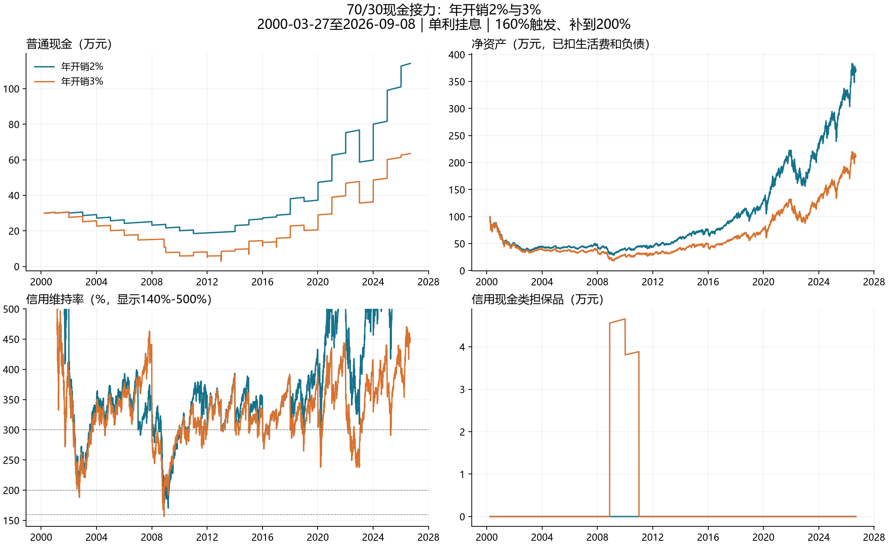

# 70/30现金接力：年度3%提取的风险测试

研究日期：2026-09-15。沿用上一阶段QQQ数据快照，截止2026-09-08；没有更新或拼接新行情。

**结论应同时看完整主路径、不同起点和压力情景。2000年高点主路径虽完成，3%版本普通现金最低不足一年开销，不能直接把3%称为已验证安全的提取率。**

## 本次变更与固定条件

- 将年度融资目标和年度生活支出同时提高至初始资产3%，即初始100万元每年花3万元。不是借3万元、只花2万元。融资仍可暂停，不能理解为每年必定拿得到贷款。
- 初始仍70万元股票放信用、30万元现金放普通；买股底线主版本仍是初始30万元，现相当10年开销。另测15年开销门槛，即现金必须超过45万元才允许补股票；它不等于把初始配比改成55/45。
- 比例再平衡按总资产而非净资产；2.8%单利长期挂息；现金及抽象现金类担保证券年收益2%；160%触发补担保到200%，可以用尽普通现金；主版本不主动还本或付息。
- 300%转出约束、融资保证金与可转自有股票检查不变；年度开始融资，两交收环节后付全年生活费，再调仓。140%是研究停止线，并非对国信实际即时强平线的重新认定。
- 价格是QQQ复权代理，未计人民币汇率、三只境内ETF溢折价、实际税费与银行理财赎回限制。现金类证券资格及收益留在证券中的处理仍属模型假设。

## 2000年高点起投：与原2%版本比较

| 指标 | 原2% | 新3% |
| --- | --- | --- |
| 实际运行截止 | 2026-09-08 | 2026-09-08 |
| 期末净资产/万元 | 372.39 | 213.08 |
| 期末总负债/万元 | 47.43 | 42.60 |
| 累计生活支出/万元 | 54.00 | 81.00 |
| 实际融资年数 | 18 | 11 |
| 最低普通现金/万元 | 18.50 | 2.98 |
| 最低普通现金/年开销 | 9.25 | 0.99 |
| 最低信用维持率 | 166.72% | 156.02% |
| 净资产最大回撤 | 71.58% | 82.38% |
| 累计补担保/万元 | 0.00 | 4.56 |

3%版本最低现金发生在2013-01-03，约29,840元。它是日频序列的低点，不能据此说当年已经付不起生活费；本条路径确实付满了27年的81万元。相比之下，2%版本支出54万元，因此不能将两者期末净资产差额全部解释为投资收益差。

3%版本的期末负债反而略少，并不代表更安全：融资金额变大后，操作后300%的要求更难满足，更多年份被迫使用普通现金。本次主路径3%只融资11年，其余16年靠现金支付；2%融资18年，其余9年用现金。

## 其他历史起点

| 起点 | 运行截止 | 3%状态 | 期末净资产/万元 | 最低普通现金/年开销 | 最低维持率 |
| --- | --- | --- | --- | --- | --- |
| 2000-03-27 | 2026-09-08 | 完成 | 213.08 | 0.99 | 156.02% |
| 2009-03-09 | 2026-09-08 | 完成 | 1,373.58 | 10.00 | 703.74% |
| 2007-10-31 | 2026-09-08 | 完成 | 755.53 | 9.99 | 329.81% |
| 2020-02-19 | 2026-09-08 | 完成 | 222.17 | 10.00 | 535.73% |
| 2021-11-19 | 2026-09-08 | 完成 | 139.84 | 10.00 | 424.85% |

同一行才是同一持有期限。上涨起点能通过，并不能抵消较早起点遭遇多年下跌和现金耗尽的风险。

## 滚动窗口

每季度首个可用交易日起投，分别持有固定10年、20年。另列至少持有5年至同一数据末日的观察，不将其和固定期限合并。窗口重叠，失败占比不是未来失败概率。

| 版本 | 持有期限 | 窗口数 | 失败数 | 最低维持率 | 最低现金/年开销 |
| --- | --- | --- | --- | --- | --- |
| 2%开销，30%现金底线 | 10 | 71 | 0 | 154.61% | 9.39 |
| 2.5%开销，30%现金底线 | 10 | 71 | 0 | 155.39% | 5.29 |
| 3%开销，30%现金底线 | 10 | 71 | 0 | 152.28% | 2.80 |
| 3%开销，45%买股现金门槛 | 10 | 71 | 0 | 153.86% | 2.81 |
| 2%开销，30%现金底线 | 20 | 31 | 0 | 154.61% | 9.39 |
| 2.5%开销，30%现金底线 | 20 | 31 | 0 | 155.39% | 5.29 |
| 3%开销，30%现金底线 | 20 | 31 | 0 | 152.28% | 2.40 |
| 3%开销，45%买股现金门槛 | 20 | 31 | 0 | 153.86% | 2.42 |
| 2%开销，30%现金底线 | to_end_min5 | 91 | 0 | 154.61% | 9.39 |
| 2.5%开销，30%现金底线 | to_end_min5 | 91 | 0 | 155.39% | 5.29 |
| 3%开销，30%现金底线 | to_end_min5 | 91 | 0 | 152.28% | 2.40 |
| 3%开销，45%买股现金门槛 | to_end_min5 | 91 | 0 | 153.86% | 2.42 |

本次所测历史滚动起点未出现3%主版本失败，但这不构成其他价格路径或制度条件下的保证。

## 压力测试

| 情景 | 原2% | 新3% | 新3%首次失败/期末日期 |
| --- | --- | --- | --- |
| 现金收益0% | 完成 | LiquidityFailure | 2013-01-04 |
| 融资利率4% | 完成 | 完成 | 2026-09-08 |
| 融资利率6% | 完成 | 完成 | 2026-09-08 |
| 生活费每年增长2% | 完成 | LiquidityFailure | 2026-01-06 |
| 2008低位额外永久跌20% | MarginFailure | LiquidityFailure | 2012-01-05 |
| 人工：40年股票价格不变 | LiquidityFailure | LiquidityFailure | 2019-01-03 |
| 人工：先10年每年跌5%，后30年涨5% | 完成 | LiquidityFailure | 2016-01-05 |
| 利率4%＋现金0%＋生活费年增2%＋股票每年额外损耗1% | 完成 | LiquidityFailure | 2011-01-05 |

LiquidityFailure：按当前年度执行顺序，到支出日无法支付整年生活费；不是资产一定归零。MarginFailure：信用维持率触及140%研究停止线；不是对实际券商何时卖出证券的预测。人为路径不代表未来概率。通胀分支沿用原模型：现金补仓门槛也随当年预算增长。

## 重要区分：支付顺序问题与担保品无法释放

不能仅凭LiquidityFailure就判断经济上破产。现金收益0%的失败时点，信用维持率348.46%，可转担保品约5.57万元，足以覆盖1.65万元的现金缺口；先付生活费、后调仓的顺序阻止了当年卖股补款。这主要是提前安排变现的问题。

开销年增2%的原失败时点则不同：虽然维持率414.47%，自有可转股票库存已经为0，剩余股票属于融资持仓，不能假定全部都可划出。这是库存与执行路径的约束，而不是仅检查维持率就能发现的问题。

另做“年初先再平衡，再安排融资及生活费”的完整路径对照，上述两种场景均能完成。因此，它们不是3%在任何执行方式下必然断供的证据；但该对照改变了整个历史中的调仓、融资和库存路径，并非到了失败当天调整一下顺序就一定能挽救。未用该对照替换当前主规则。

| 原失败场景 | 失败时维持率 | 现金缺口/万元 | 当时可转担保/万元 | 改为先调仓后的结果 |
| --- | --- | --- | --- | --- |
| 现金收益0% | 348.46% | 1.65 | 5.57 | 完成至2026-09-08 |
| 生活费每年增长2% | 414.47% | 0.79 | 0.00 | 完成至2026-09-08 |
| 2008低位额外永久跌20% | 296.54% | 0.86 | 0.00 | 2012-01-05仍失败 |
| 人工：40年股票价格不变 | 233.08% | 1.70 | 0.00 | 2019-01-03仍失败 |
| 人工：先10年每年跌5%，后30年涨5% | 279.63% | 2.19 | 0.00 | 2016-01-05仍失败 |
| 利率4%＋现金0%＋生活费年增2%＋股票每年额外损耗1% | 305.57% | 0.75 | 0.48 | 2012-01-05仍失败 |

可转金额是失败当日按模型计算的容量，不保证之前就有同样容量，也不保证能即时到账。2008低位额外跌20%、40年横盘、前10年每年跌5%等场景，即使先调仓仍会失败；当时维持率低于300%，原有净资产并不能自由变成普通账户生活现金。这些是当前零主动还款规则下更实质的流动性风险。

## 15年门槛能否解决问题

| 主路径设定 | 期末净资产/万元 | 最低现金/年开销 | 最低维持率 | 融资年数 |
| --- | --- | --- | --- | --- |
| 2%开销，30%现金底线 | 372.39 | 9.25 | 166.72% | 18 |
| 2.5%开销，30%现金底线 | 280.80 | 4.59 | 156.93% | 13 |
| 3%开销，30%现金底线 | 213.08 | 0.99 | 156.02% | 11 |
| 3%开销，45%买股现金门槛 | 206.34 | 1.01 | 155.52% | 10 |

提高买股票的现金门槛只会减少补仓，并不会凭空多出15年的储备。现金初始依然只有30万元；生活费和救险都可以继续消耗这笔钱。因此，需要结合实际失败数和压力路径判断，不能仅把参数改回“15年”就称为恢复安全。

## 逐年执行明细：3%版本，2000年起投

金额万元，最后一年截至2026-09-08。融资列指实际是否融资。

| 年 | 融资 | 普通现金 | 信用股票 | 信用现金类 | 本金 | 未付息 | 年内最低M | 净资产 |
| --- | --- | --- | --- | --- | --- | --- | --- | --- |
| 2000 | 是 | 30.43 | 34.70 | 0.00 | 3.00 | 0.06 | 1053.28% | 62.07 |
| 2001 | 是 | 30.59 | 23.21 | 0.00 | 6.00 | 0.23 | 262.27% | 47.57 |
| 2002 | 否 | 28.15 | 14.53 | 0.00 | 6.00 | 0.40 | 185.26% | 36.28 |
| 2003 | 否 | 25.65 | 21.75 | 0.00 | 6.00 | 0.57 | 216.63% | 40.83 |
| 2004 | 否 | 23.10 | 24.05 | 0.00 | 6.00 | 0.74 | 289.29% | 40.41 |
| 2005 | 否 | 20.51 | 24.42 | 0.00 | 6.00 | 0.90 | 304.67% | 38.02 |
| 2006 | 否 | 17.86 | 26.17 | 0.00 | 6.00 | 1.07 | 307.44% | 36.95 |
| 2007 | 否 | 15.16 | 31.15 | 0.00 | 6.00 | 1.24 | 359.06% | 39.06 |
| 2008 | 是 | 10.84 | 18.15 | 4.57 | 9.00 | 1.49 | 156.02% | 23.07 |
| 2009 | 否 | 8.00 | 28.07 | 4.66 | 9.00 | 1.74 | 191.92% | 29.99 |
| 2010 | 否 | 6.00 | 33.68 | 3.89 | 9.00 | 2.00 | 272.04% | 32.58 |
| 2011 | 否 | 8.14 | 33.75 | 0.00 | 9.00 | 2.25 | 269.20% | 30.65 |
| 2012 | 否 | 5.98 | 39.04 | 0.00 | 9.00 | 2.50 | 298.84% | 33.52 |
| 2013 | 否 | 8.69 | 45.92 | 0.00 | 9.00 | 2.75 | 294.94% | 42.86 |
| 2014 | 是 | 9.84 | 53.56 | 0.00 | 12.00 | 3.09 | 288.38% | 48.31 |
| 2015 | 否 | 14.47 | 50.37 | 0.00 | 12.00 | 3.42 | 247.94% | 49.42 |
| 2016 | 否 | 13.79 | 51.63 | 0.00 | 12.00 | 3.76 | 264.37% | 49.66 |
| 2017 | 否 | 16.18 | 61.90 | 0.00 | 12.00 | 4.10 | 300.00% | 61.99 |
| 2018 | 是 | 23.21 | 55.51 | 0.00 | 15.00 | 4.52 | 264.64% | 59.21 |
| 2019 | 否 | 20.61 | 77.14 | 0.00 | 15.00 | 4.94 | 275.60% | 77.82 |
| 2020 | 是 | 29.57 | 102.21 | 0.00 | 18.00 | 5.44 | 232.26% | 108.33 |
| 2021 | 是 | 39.72 | 118.06 | 0.00 | 21.00 | 6.03 | 330.94% | 130.76 |
| 2022 | 是 | 47.76 | 74.63 | 0.00 | 24.00 | 6.70 | 232.68% | 91.70 |
| 2023 | 否 | 36.33 | 129.85 | 0.00 | 24.00 | 7.37 | 238.45% | 134.82 |
| 2024 | 是 | 49.57 | 147.11 | 0.00 | 27.00 | 8.13 | 328.92% | 161.55 |
| 2025 | 是 | 61.32 | 165.26 | 0.00 | 30.00 | 8.97 | 281.24% | 187.61 |
| 2026 | 是 | 63.47 | 192.21 | 0.00 | 33.00 | 9.60 | 351.93% | 213.08 |

完整配置、数据哈希、年度/日频账和失败诊断保存在results/withdrawal_3pct。所有正常年度做资产变动对账，本息实际偿还均为0。2.5%只是同底线的中间敏感性，不是据本轮结果给出的安全提取率承诺。
