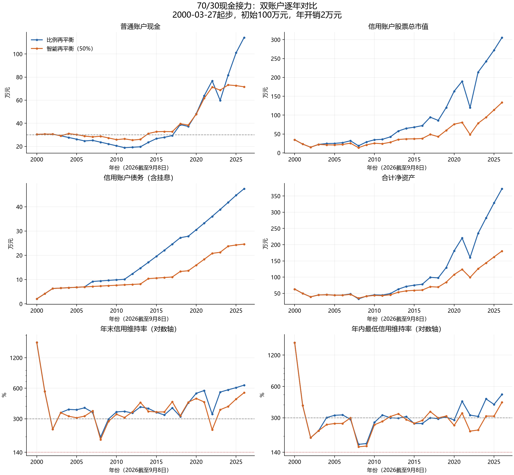
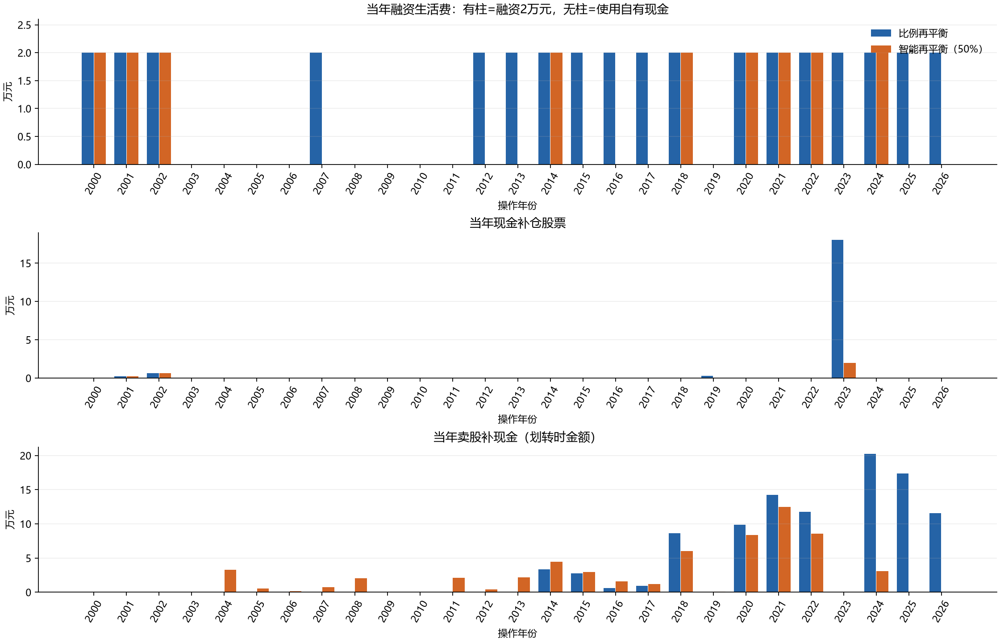

# 70/30现金接力：智能再平衡与比例再平衡

记录日期：2026-09-12。主参数：上涨年股票投资盈利提取50%；下跌年最多补仓1年开销，且保留15年开销现金。

同口径2000高点路径，智能版期末净资产180.44万元，比例版372.39万元。智能版最低现金储备更高，但融资年数更少；不能从策略名称推断其风险收益优于比例再平衡。

## 固定规则与本轮日历

- 年开销B=初始资产的2%，不随物价、股价或净资产变化。初始100万元，B=2万元，现金门槛15B=30万元。股票使用QQQ复权日频OHLC全收益代理，现金收益2%，融资利率2.8%，ACT/365单利长期挂账。利息计入负债、不成为计息本金。
- 普通账户保存现金类资产及可提现现金；信用账户保存自有股票及融资股票，不配置现金类资产。证券和现金在途单列，不提前算入信用担保。净资产=普通总资产+信用总资产+在途资产−本金−挂息；配置比例以总资产为分母。
- 两策略共同按自然年操作：年末收盘确认当年股票投资盈亏，下一年首个交易日先申请年度生活融资；划转T+1，普通卖款提现T+1，支付年度生活费后执行再平衡；卖股再平衡需另一次T+1转出。操作集中在年初几个交易日，不能在未看到年末收盘前使用全年收益。
- 首个不完整年度在入场日建仓并申请首年生活融资，首次生活费两交易日后支付，不做额外起始再平衡。以后每个自然年支付一次；2000主路径共27次、54万元。2000是入场至年末的不足一年，2026是截至9月8日的未完年度。2026年的操作依据2025盈利，2026未完年度盈利尚不触发调仓。
- 相比上一版的“入场周年融资＋年末开盘比例再平衡”，本轮统一为年度集中操作。因此比例版应采用本轮重跑的372.39万元；旧版380.11万元只作旧日历参考。其他核心经济参数不变。
- 年度股票盈利=sum(价格变化×该时段实际股票份额)，包含股票股息再投资代理收益，剔除融资买入、补仓和转出造成的本金流动；现金收益和融资利息单列。按你允许的近似，直接使用年初股票市值×全年收益率也接近，但本程序保留准确逐日计量。极接近零收益的年份可能因年初几天交易而改变盈亏符号。
- 智能版：上一年度股票亏损时，买入min(B，普通现金−15B)，下限0；上一年度股票盈利时，请求转出盈利的50%。维持率不高于300%则不转出；高于时仅卖出可转额度内的自有担保股票，不强制恢复70/30。
- 比例版：股票高于总资产70%时卖出超配部分，受同样转出限制；股票不足70%时只用高于15B的现金补足，买入不超过恢复70%的需要。
- 生活融资先执行，再平衡后执行。当前维持率高于300%并不保证融资成功，还须满足融资并转出后300%、完整保证金余额及足量自有担保品；不够借足1年则本年不借，使用普通现金。禁止把仍关联未偿融资的股票直接转出。
- 无主动还本付息、无补担保、无外部收入；主场景假定允许六个月一续及长期挂息。信用维持率低于140%记MarginFailure，生活费到期不足记LiquidityFailure，均停止；拒绝新融资本身不是失败。140%是模型压力线。

## 主路径结果

| 指标 | 比例再平衡 | 智能再平衡50% |
| --- | --- | --- |
| 期末净资产/万元 | 372.39 | 180.44 |
| 普通现金/万元 | 114.21 | 71.57 |
| 信用股票总市值/万元 | 305.61 | 133.47 |
| 信用自有股票/万元 | 28.23 | 0.00 |
| 信用融资股票/万元 | 277.38 | 133.47 |
| 信用债务含挂息/万元 | 47.43 | 24.61 |
| 期末信用净权益/万元 | 258.17 | 108.87 |
| 最低维持率 | 166.72% | 157.76% |
| 最低现金/年开销 | 9.25 | 11.72 |
| 融资年数 | 18 | 9 |
| 现金支付年数 | 9 | 18 |
| 含消费净资产最大回撤 | 71.58% | 68.61% |
| 股票占总资产最高比例 | 78.22% | 70.59% |
| 股票占净资产最高比例 | 97.28% | 74.77% |
| 累计补仓/万元 | 19.23 | 2.87 |
| 累计卖股划转/万元 | 101.36 | 60.26 |

两种策略本息偿还均为0，信用现金类资产逐日均为0。年末普通账户没有滞留股票，年度合计账表仍列入在途资产以保证可勾稽。

一个关键差异发生在2023年初：2022下跌后，比例版用现金买回约18.05万元股票，智能版只买2万元。智能版此前上涨年持续提取盈利、下跌年补仓又受固定金额限制，这种不对称改变了后续股票持有规模。

智能版2024年将剩余自有担保股票转出后，自有库存归零；2025、2026年虽维持率恢复到300%以上，仍不能融资套现或再卖这部分融资股票。这是沿用本项目自有担保品限制的结果，不是“维持率低于300%”。若实际合同允许不同的债务关联解除机制，需要另立执行版本重测，不能直接把本结果套用。

## 普通账户：逐年比较

金额均为万元；收益为普通现金当年产生的收益。卖股列按发起划转时金额，到账实际成交差额进入当年股票盈亏。

| 年份 | 比例现金 | 智能现金 | 比例现金收益 | 智能现金收益 | 比例补仓 | 智能补仓 | 比例卖股 | 智能卖股 |
| --- | --- | --- | --- | --- | --- | --- | --- | --- |
| 2000 | 30.44 | 30.44 | 0.45 | 0.45 | 0.00 | 0.00 | 0.00 | 0.00 |
| 2001 | 30.59 | 30.59 | 0.60 | 0.60 | 0.23 | 0.23 | 0.00 | 0.00 |
| 2002 | 30.59 | 30.59 | 0.60 | 0.60 | 0.64 | 0.64 | 0.00 | 0.00 |
| 2003 | 29.17 | 29.17 | 0.57 | 0.57 | 0.00 | 0.00 | 0.00 | 0.00 |
| 2004 | 27.71 | 31.07 | 0.55 | 0.61 | 0.00 | 0.00 | 0.00 | 3.28 |
| 2005 | 26.22 | 30.19 | 0.51 | 0.59 | 0.00 | 0.00 | 0.00 | 0.53 |
| 2006 | 24.71 | 28.91 | 0.48 | 0.57 | 0.00 | 0.00 | 0.00 | 0.15 |
| 2007 | 25.20 | 28.21 | 0.50 | 0.56 | 0.00 | 0.00 | 0.00 | 0.75 |
| 2008 | 23.66 | 28.78 | 0.47 | 0.57 | 0.00 | 0.00 | 0.00 | 2.06 |
| 2009 | 22.10 | 27.31 | 0.43 | 0.54 | 0.00 | 0.00 | 0.00 | 0.00 |
| 2010 | 20.50 | 25.82 | 0.40 | 0.51 | 0.00 | 0.00 | 0.00 | 0.00 |
| 2011 | 18.87 | 26.50 | 0.37 | 0.52 | 0.00 | 0.00 | 0.00 | 2.14 |
| 2012 | 19.24 | 25.44 | 0.38 | 0.50 | 0.00 | 0.00 | 0.00 | 0.43 |
| 2013 | 19.64 | 26.10 | 0.39 | 0.51 | 0.00 | 0.00 | 0.00 | 2.16 |
| 2014 | 23.47 | 31.14 | 0.46 | 0.61 | 0.00 | 0.00 | 3.37 | 4.43 |
| 2015 | 26.70 | 32.69 | 0.52 | 0.64 | 0.00 | 0.00 | 2.76 | 2.94 |
| 2016 | 27.85 | 32.88 | 0.55 | 0.64 | 0.00 | 0.00 | 0.59 | 1.56 |
| 2017 | 29.37 | 32.75 | 0.57 | 0.64 | 0.00 | 0.00 | 0.94 | 1.22 |
| 2018 | 38.85 | 39.60 | 0.76 | 0.78 | 0.00 | 0.00 | 8.66 | 6.03 |
| 2019 | 37.27 | 38.44 | 0.73 | 0.75 | 0.31 | 0.00 | 0.00 | 0.09 |
| 2020 | 48.24 | 47.84 | 0.94 | 0.94 | 0.00 | 0.00 | 9.89 | 8.35 |
| 2021 | 63.81 | 61.59 | 1.25 | 1.20 | 0.00 | 0.00 | 14.22 | 12.45 |
| 2022 | 76.73 | 71.31 | 1.50 | 1.39 | 0.00 | 0.00 | 11.77 | 8.59 |
| 2023 | 59.84 | 68.66 | 1.18 | 1.34 | 18.05 | 2.00 | 0.00 | 0.00 |
| 2024 | 81.65 | 73.18 | 1.61 | 1.45 | 0.00 | 0.00 | 20.23 | 3.11 |
| 2025 | 101.02 | 72.61 | 1.97 | 1.42 | 0.00 | 0.00 | 17.35 | 0.00 |
| 2026 | 114.21 | 71.57 | 1.54 | 0.97 | 0.00 | 0.00 | 11.59 | 0.00 |

## 信用账户：逐年比较

金额均为万元；信用股票总市值=信用自有股票+信用融资股票。债务=本金+未付单利。

| 年份 | 比例股票 | 智能股票 | 比例自有股票 | 智能自有股票 | 比例债务 | 智能债务 | 比例信用净权益 | 智能信用净权益 |
| --- | --- | --- | --- | --- | --- | --- | --- | --- |
| 2000 | 34.70 | 34.70 | 33.71 | 33.71 | 2.04 | 2.04 | 32.66 | 32.66 |
| 2001 | 23.28 | 23.28 | 21.29 | 21.29 | 4.15 | 4.15 | 19.12 | 19.12 |
| 2002 | 14.95 | 14.95 | 12.47 | 12.47 | 6.32 | 6.32 | 8.63 | 8.63 |
| 2003 | 22.38 | 22.38 | 18.67 | 18.67 | 6.49 | 6.49 | 15.89 | 15.89 |
| 2004 | 24.73 | 21.17 | 20.63 | 17.07 | 6.66 | 6.66 | 18.07 | 14.51 |
| 2005 | 25.12 | 20.95 | 20.96 | 16.78 | 6.83 | 6.83 | 18.29 | 14.12 |
| 2006 | 26.92 | 22.28 | 22.45 | 17.82 | 6.99 | 6.99 | 19.92 | 15.29 |
| 2007 | 32.04 | 25.65 | 24.36 | 20.34 | 9.22 | 7.16 | 22.82 | 18.49 |
| 2008 | 18.67 | 13.72 | 14.20 | 10.62 | 9.44 | 7.33 | 9.23 | 6.38 |
| 2009 | 28.88 | 21.22 | 21.96 | 16.43 | 9.67 | 7.50 | 19.21 | 13.72 |
| 2010 | 34.69 | 25.49 | 26.38 | 19.74 | 9.89 | 7.67 | 24.80 | 17.82 |
| 2011 | 35.90 | 24.19 | 27.30 | 18.24 | 10.11 | 7.83 | 25.79 | 16.36 |
| 2012 | 42.40 | 28.07 | 29.93 | 21.04 | 12.40 | 8.00 | 30.01 | 20.07 |
| 2013 | 57.94 | 35.48 | 38.23 | 25.88 | 14.73 | 8.17 | 43.21 | 27.31 |
| 2014 | 64.97 | 36.93 | 39.08 | 23.09 | 17.12 | 10.40 | 47.85 | 26.53 |
| 2015 | 68.03 | 37.14 | 37.52 | 22.00 | 19.57 | 10.62 | 48.46 | 26.52 |
| 2016 | 72.20 | 38.03 | 37.34 | 21.81 | 22.07 | 10.84 | 50.13 | 27.19 |
| 2017 | 94.55 | 48.86 | 45.67 | 27.35 | 24.63 | 11.07 | 69.92 | 37.80 |
| 2018 | 86.05 | 42.96 | 35.24 | 19.48 | 27.25 | 13.35 | 58.80 | 29.62 |
| 2019 | 120.00 | 59.58 | 49.39 | 26.95 | 27.87 | 13.63 | 92.14 | 45.95 |
| 2020 | 163.40 | 76.02 | 55.67 | 24.66 | 30.54 | 15.96 | 132.86 | 60.06 |
| 2021 | 189.70 | 80.65 | 49.89 | 12.66 | 33.27 | 18.36 | 156.43 | 62.29 |
| 2022 | 119.90 | 48.54 | 24.29 | 1.36 | 36.05 | 20.80 | 83.85 | 27.74 |
| 2023 | 213.86 | 78.29 | 62.74 | 5.23 | 38.89 | 21.25 | 174.98 | 57.04 |
| 2024 | 242.32 | 94.29 | 50.01 | 0.00 | 41.79 | 23.76 | 200.54 | 70.53 |
| 2025 | 272.22 | 113.87 | 37.56 | 0.00 | 44.74 | 24.26 | 227.48 | 89.61 |
| 2026 | 305.61 | 133.47 | 28.23 | 0.00 | 47.43 | 24.61 | 258.17 | 108.87 |

## 净资产和信用维持率：逐年比较

年内最低值包含开盘、操作后、日内最低价及收盘；年末值不能代替年内风险。

| 年份 | 比例净资产/万 | 智能净资产/万 | 比例年末维持率 | 智能年末维持率 | 比例年内最低 | 智能年内最低 |
| --- | --- | --- | --- | --- | --- | --- |
| 2000 | 63.10 | 63.10 | 1699.04% | 1699.04% | 1579.92% | 1579.92% |
| 2001 | 49.72 | 49.72 | 560.32% | 560.32% | 394.63% | 394.63% |
| 2002 | 39.22 | 39.22 | 236.47% | 236.47% | 192.92% | 192.92% |
| 2003 | 45.05 | 45.05 | 344.76% | 344.76% | 225.56% | 225.56% |
| 2004 | 45.79 | 45.58 | 371.45% | 317.96% | 301.07% | 257.71% |
| 2005 | 44.52 | 44.31 | 368.00% | 306.85% | 317.01% | 264.33% |
| 2006 | 44.63 | 44.20 | 384.85% | 318.64% | 319.79% | 264.77% |
| 2007 | 48.02 | 46.70 | 347.54% | 358.14% | 290.36% | 299.00% |
| 2008 | 32.89 | 35.16 | 197.70% | 187.09% | 166.72% | 157.76% |
| 2009 | 41.31 | 41.03 | 298.73% | 282.92% | 169.63% | 160.55% |
| 2010 | 45.30 | 43.64 | 350.78% | 332.46% | 270.96% | 256.72% |
| 2011 | 44.65 | 42.86 | 354.95% | 308.77% | 318.41% | 276.90% |
| 2012 | 49.25 | 45.51 | 342.09% | 350.75% | 300.15% | 308.53% |
| 2013 | 62.85 | 53.41 | 393.31% | 434.23% | 297.24% | 327.54% |
| 2014 | 71.32 | 57.67 | 379.44% | 355.22% | 308.40% | 288.44% |
| 2015 | 75.17 | 59.21 | 347.64% | 349.77% | 264.05% | 265.50% |
| 2016 | 77.97 | 60.07 | 327.09% | 350.77% | 264.33% | 282.91% |
| 2017 | 99.30 | 70.54 | 383.87% | 441.55% | 300.00% | 344.22% |
| 2018 | 97.64 | 69.21 | 315.77% | 321.88% | 293.79% | 299.46% |
| 2019 | 129.41 | 84.39 | 430.64% | 437.21% | 305.95% | 311.87% |
| 2020 | 181.11 | 107.90 | 535.06% | 476.19% | 285.14% | 253.58% |
| 2021 | 220.24 | 123.88 | 570.22% | 439.37% | 432.08% | 332.78% |
| 2022 | 160.58 | 99.05 | 332.61% | 233.35% | 318.32% | 223.31% |
| 2023 | 234.82 | 125.70 | 549.98% | 368.46% | 309.08% | 228.87% |
| 2024 | 282.18 | 143.71 | 579.89% | 396.89% | 455.44% | 311.65% |
| 2025 | 328.50 | 162.22 | 608.45% | 469.38% | 403.44% | 311.11% |
| 2026 | 372.39 | 180.44 | 644.29% | 542.43% | 502.51% | 422.91% |

## 每一年是否融资

“是”表示该年新增生活融资本金2万元；“否”表示普通现金支付。下面是实际操作年份，调仓盈亏信号来自上一年度。

| 年份 | 比例融资 | 智能融资 | 比例未融资原因 | 智能未融资原因 |
| --- | --- | --- | --- | --- |
| 2000 | 是 | 是 | — | — |
| 2001 | 是 | 是 | — | — |
| 2002 | 是 | 是 | — | — |
| 2003 | 否 | 否 | 维持率不高于300% | 维持率不高于300% |
| 2004 | 否 | 否 | 融资并转出后不足300% | 融资并转出后不足300% |
| 2005 | 否 | 否 | 融资并转出后不足300% | 融资并转出后不足300% |
| 2006 | 否 | 否 | 融资并转出后不足300% | 融资并转出后保证金余额不足 |
| 2007 | 是 | 否 | — | 融资并转出后不足300% |
| 2008 | 否 | 否 | 融资并转出后不足300% | 融资并转出后不足300% |
| 2009 | 否 | 否 | 维持率不高于300% | 维持率不高于300% |
| 2010 | 否 | 否 | 融资并转出后不足300% | 维持率不高于300% |
| 2011 | 否 | 否 | 融资并转出后不足300% | 融资并转出后不足300% |
| 2012 | 是 | 否 | — | 融资并转出后不足300% |
| 2013 | 是 | 否 | — | 融资并转出后不足300% |
| 2014 | 是 | 是 | — | — |
| 2015 | 是 | 否 | — | 融资并转出后不足300% |
| 2016 | 是 | 否 | — | 融资并转出后不足300% |
| 2017 | 是 | 否 | — | 融资并转出后不足300% |
| 2018 | 是 | 是 | — | — |
| 2019 | 否 | 否 | 融资并转出后不足300% | 融资并转出后不足300% |
| 2020 | 是 | 是 | — | — |
| 2021 | 是 | 是 | — | — |
| 2022 | 是 | 是 | — | — |
| 2023 | 是 | 否 | — | 维持率不高于300% |
| 2024 | 是 | 是 | — | — |
| 2025 | 是 | 否 | — | 可转自有股票不足一年开销 |
| 2026 | 是 | 否 | — | 可转自有股票不足一年开销 |

## 固定10年和20年滚动检验

季度首个可用交易日起步，首个不完整季度从1999-03-10开始，终点为起点加指定周年的前一天。因采用自然年支付生活费，跨非一月起点的10年窗口可能包含11次自然年度预算；两策略在同窗口完全一致。窗口高度重叠，不是独立样本的未来破产概率。

| 策略 | 期限 | 窗口数 | 失败数 | 最低期末净资产/万元 | 最低维持率 | 最低现金/年 | 智能终值高于比例的窗口数 |
| --- | --- | --- | --- | --- | --- | --- | --- |
| 比例再平衡 | 10 | 71 | 0 | 43.40 | 152.05% | 11.14 | — |
| 比例再平衡 | 20 | 31 | 0 | 128.36 | 152.05% | 9.57 | — |
| 智能再平衡（50%） | 10 | 71 | 0 | 43.89 | 146.63% | 12.74 | 5 |
| 智能再平衡（50%） | 20 | 31 | 0 | 104.84 | 146.63% | 12.00 | 0 |

## 盈利提取比例x敏感性

这里只测试预先选定的25%、37.5%、50%、62.5%、75%。不以2000高点终值单独寻找最优解。

| x | 2000起步期末净资产/万 | 最低维持率 | 最低现金/年 | 融资年数 | 10年优于比例窗口数 | 20年优于比例窗口数 |
| --- | --- | --- | --- | --- | --- | --- |
| 25% | 291.61 | 147.18% | 10.09 | 16 | 20 | 0 |
| 37.5% | 234.40 | 165.04% | 11.42 | 12 | 5 | 0 |
| 50% | 180.44 | 157.76% | 11.72 | 9 | 5 | 0 |
| 62.5% | 173.59 | 152.61% | 12.05 | 9 | 6 | 0 |
| 75% | 171.79 | 148.13% | 12.01 | 9 | 7 | 0 |

在这组候选中，25%在2000起点的终值最高，但没有据此证明最优；它的最低维持率仍需共同看待。降低提取比例会保留更多股票，同时让现金和担保安全的取舍改变。这里没有新增的独立样本外数据。

## 多个起点至同一终点

期限不同，不可按终值比较起点优劣；同一起点的两策略可以配对。

| 起点 | 策略 | 净资产/万元 | 最低维持率 | 最低现金/年 | 融资年数 | 失败 |
| --- | --- | --- | --- | --- | --- | --- |
| 1999-03-10 | 比例再平衡 | 900.71 | 171.83% | 15.00 | 26 | 无 |
| 1999-03-10 | 智能再平衡（50%） | 528.64 | 148.01% | 15.00 | 18 | 无 |
| 2000-03-27 | 比例再平衡 | 372.39 | 166.72% | 9.25 | 18 | 无 |
| 2000-03-27 | 智能再平衡（50%） | 180.44 | 157.76% | 11.72 | 9 | 无 |
| 2007-10-31 | 比例再平衡 | 780.81 | 494.49% | 14.99 | 20 | 无 |
| 2007-10-31 | 智能再平衡（50%） | 464.49 | 275.58% | 14.99 | 17 | 无 |
| 2020-02-19 | 比例再平衡 | 229.96 | 803.84% | 15.00 | 7 | 无 |
| 2020-02-19 | 智能再平衡（50%） | 199.91 | 563.91% | 15.00 | 7 | 无 |
| 2021-11-19 | 比例再平衡 | 146.37 | 637.37% | 15.00 | 6 | 无 |
| 2021-11-19 | 智能再平衡（50%） | 135.44 | 504.71% | 15.00 | 6 | 无 |

## 会计验证与可复现性

逐日验证交易前后净资产守恒、本金和利息勾稽、非负库存、信用账户无现金类资产。逐年核对：净资产变化=股票投资盈亏+现金收益−新增利息−生活支出。27项测试通过，包括现金底仓、300%转出限额、拒绝转出、融资不算盈利，以及改变未来行情不影响此前结果。

行情沿用data/qqq_daily.json，1999-03-10—2026-09-08共6917行，未联网更新。来源和SHA-256见本目录provenance.json及data/audit.json。现金收益是确定代理；忽略税费、汇率、QDII折溢价、国内节假日和成交失败，不补造QQQ上市前数据。结果以长期挂息及续约条件成立为前提。

结果文件在results/smart_relay：五个起点×两策略的日账、年度账、交易事件；6种策略参数×102个窗口=612个滚动场景。两主策略中每年是否融资、融资日期及未融资原因保存在annual.json。

复现：`python -m unittest test_smart_relay test_relay_backtest test_backtest -v`；`python smart_relay.py`；`python build_smart_report.py`。生成图表使用项目results/smart_relay_python中的matplotlib依赖。
