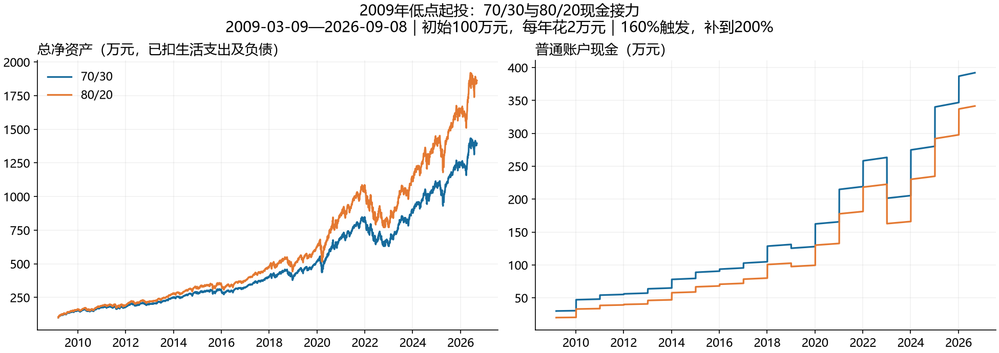

# 2009年低点起投：70/30与80/20现金接力

区间：2009-03-09收盘起投，至2026-09-08。只更改起点，并统一使用用户选定的160%触发、200%目标补担保规则。

**80/20期末净资产比70/30多466.89万元（高33.45%）。**

本地QQQ日线中，2009年最低收盘、最低复权收盘和最低复权日内价都发生在2009-03-09。本次使用该日收盘价，不使用日内最低价作为成交价。这是按用户要求事后选取的有利起点，不代表当时能识别底部。纳斯达克也将2009年3月描述为该轮危机低点：[Nasdaq历史回顾](https://indexes.nasdaq.com/docs/Nasdaq-100_A%20Tale%20of%20Three%20Crises%20over%20Two%20Decades.pdf)。

初始100万元；生活费固定每年2万元；融资2.8%单利挂息；普通现金/现金类证券收益2%；买股分别只使用超过15年/10年开销的普通现金；总资产配比再平衡。补担保可用尽普通现金，优先现金类证券划转，次交易日到账；主版本不主动还本付息。其余融资资格、交收、300%转出门槛、年度操作顺序均沿用前次模型。

使用QQQ复权历史代理，未计人民币汇率和三只境内ETF溢折价、实际费税；数据截止沿用上一轮，未更新行情。2009和2026均不完整年度，模型仍各支取全年预算，共18次、36万元。

| 指标 | 70/30 | 80/20 |
| --- | --- | --- |
| 期末净资产/万元 | 1395.94 | 1862.83 |
| 普通账户现金/万元 | 392.08 | 341.54 |
| 信用股票/万元 | 1049.11 | 1566.53 |
| 信用现金类担保品/万元 | 0.00 | 0.00 |
| 融资本金/万元 | 36.00 | 36.00 |
| 未付利息/万元 | 9.25 | 9.25 |
| 负债合计/万元 | 45.25 | 45.25 |
| 实际融资年数 | 18 | 18 |
| 累计生活支出/万元 | 36.00 | 36.00 |
| 最低普通现金/年开销 | 15.00 | 10.00 |
| 最低维持率 | 1055.36% | 1419.16% |
| 净资产最大回撤 | 25.68% | 29.10% |
| 补担保累计/万元 | 0.00 | 0.00 |
| 付息/万元 | 0.00 | 0.00 |
| 还本/万元 | 0.00 | 0.00 |

最大回撤按扣除生活支出后的日终净资产计算，包含支出影响。最低维持率则包括日内最低价。未发生补担保时，不能用本次表现证明160%/200%的救险参数更优。

## 逐年净资产与融资

| 年 | 70/30净资产/万元 | 80/20净资产/万元 | 80/20多出/万元 | 70/30融资 | 80/20融资 |
| --- | --- | --- | --- | --- | --- |
| 2009 | 153.59 | 161.30 | 7.71 | 是 | 是 |
| 2010 | 174.47 | 186.25 | 11.78 | 是 | 是 |
| 2011 | 177.87 | 190.27 | 12.39 | 是 | 是 |
| 2012 | 200.01 | 217.23 | 17.22 | 是 | 是 |
| 2013 | 252.25 | 281.86 | 29.60 | 是 | 是 |
| 2014 | 286.74 | 325.54 | 38.80 | 是 | 是 |
| 2015 | 305.76 | 349.90 | 44.14 | 是 | 是 |
| 2016 | 321.18 | 369.64 | 48.46 | 是 | 是 |
| 2017 | 398.15 | 469.89 | 71.74 | 是 | 是 |
| 2018 | 398.61 | 469.56 | 70.95 | 是 | 是 |
| 2019 | 514.06 | 622.95 | 108.89 | 是 | 是 |
| 2020 | 698.02 | 874.50 | 176.48 | 是 | 是 |
| 2021 | 839.10 | 1073.45 | 234.35 | 是 | 是 |
| 2022 | 641.05 | 785.29 | 144.24 | 是 | 是 |
| 2023 | 902.80 | 1146.54 | 243.74 | 是 | 是 |
| 2024 | 1072.53 | 1389.36 | 316.83 | 是 | 是 |
| 2025 | 1238.72 | 1630.31 | 391.59 | 是 | 是 |
| 2026 | 1395.94 | 1862.83 | 466.89 | 是 | 是 |

## 70/30逐年账户明细（万元）

| 年 | 普通现金 | 信用股票 | 信用现金类 | 本金 | 未付息 | 年末维持率 | 年内最低维持率 |
| --- | --- | --- | --- | --- | --- | --- | --- |
| 2009 | 30.53 | 125.11 | 0.00 | 2.00 | 0.05 | 6115.93% | 3500.00% |
| 2010 | 48.09 | 130.54 | 0.00 | 4.00 | 0.16 | 3140.26% | 2430.99% |
| 2011 | 55.20 | 129.00 | 0.00 | 6.00 | 0.32 | 2039.87% | 1833.06% |
| 2012 | 57.21 | 151.35 | 0.00 | 8.00 | 0.55 | 1770.49% | 1565.60% |
| 2013 | 65.01 | 198.07 | 0.00 | 10.00 | 0.83 | 1829.17% | 1386.04% |
| 2014 | 79.59 | 220.31 | 0.00 | 12.00 | 1.16 | 1673.56% | 1362.85% |
| 2015 | 90.57 | 230.74 | 0.00 | 14.00 | 1.56 | 1483.34% | 1127.61% |
| 2016 | 95.45 | 243.73 | 0.00 | 16.00 | 2.00 | 1353.82% | 1096.12% |
| 2017 | 104.84 | 313.82 | 0.00 | 18.00 | 2.51 | 1530.44% | 1198.29% |
| 2018 | 131.14 | 290.53 | 0.00 | 20.00 | 3.07 | 1259.48% | 1171.84% |
| 2019 | 127.91 | 411.83 | 0.00 | 22.00 | 3.68 | 1603.50% | 1122.94% |
| 2020 | 165.57 | 560.81 | 0.00 | 24.00 | 4.36 | 1977.70% | 1055.36% |
| 2021 | 219.05 | 651.14 | 0.00 | 26.00 | 5.08 | 2094.76% | 1589.32% |
| 2022 | 263.37 | 411.54 | 0.00 | 28.00 | 5.87 | 1215.23% | 1163.36% |
| 2023 | 205.41 | 734.10 | 0.00 | 30.00 | 6.70 | 2000.12% | 1125.42% |
| 2024 | 280.28 | 831.86 | 0.00 | 32.00 | 7.61 | 2100.37% | 1651.60% |
| 2025 | 346.77 | 934.50 | 0.00 | 34.00 | 8.56 | 2195.87% | 1457.17% |
| 2026 | 392.08 | 1049.11 | 0.00 | 36.00 | 9.25 | 2318.48% | 1809.09% |

未融资原因：每年都实际融资。

## 80/20逐年账户明细（万元）

| 年 | 普通现金 | 信用股票 | 信用现金类 | 本金 | 未付息 | 年末维持率 | 年内最低维持率 |
| --- | --- | --- | --- | --- | --- | --- | --- |
| 2009 | 20.37 | 142.98 | 0.00 | 2.00 | 0.05 | 6989.64% | 4000.00% |
| 2010 | 33.67 | 156.73 | 0.00 | 4.00 | 0.16 | 3770.35% | 2918.76% |
| 2011 | 39.27 | 157.32 | 0.00 | 6.00 | 0.32 | 2487.63% | 2235.42% |
| 2012 | 40.79 | 184.99 | 0.00 | 8.00 | 0.55 | 2164.00% | 1913.58% |
| 2013 | 47.03 | 245.65 | 0.00 | 10.00 | 0.83 | 2268.62% | 1719.03% |
| 2014 | 58.96 | 279.74 | 0.00 | 12.00 | 1.16 | 2125.07% | 1730.53% |
| 2015 | 68.08 | 297.37 | 0.00 | 14.00 | 1.56 | 1911.66% | 1453.22% |
| 2016 | 72.09 | 315.56 | 0.00 | 16.00 | 2.00 | 1752.81% | 1419.16% |
| 2017 | 79.98 | 410.41 | 0.00 | 18.00 | 2.51 | 2001.51% | 1567.12% |
| 2018 | 102.68 | 389.94 | 0.00 | 20.00 | 3.07 | 1690.44% | 1572.83% |
| 2019 | 99.49 | 549.14 | 0.00 | 22.00 | 3.68 | 2138.12% | 1507.19% |
| 2020 | 132.68 | 770.17 | 0.00 | 24.00 | 4.36 | 2716.01% | 1449.35% |
| 2021 | 181.23 | 923.31 | 0.00 | 26.00 | 5.08 | 2970.34% | 2253.63% |
| 2022 | 222.58 | 596.58 | 0.00 | 28.00 | 5.87 | 1761.60% | 1686.40% |
| 2023 | 166.03 | 1017.21 | 0.00 | 30.00 | 6.70 | 2771.50% | 1631.41% |
| 2024 | 234.72 | 1194.25 | 0.00 | 32.00 | 7.61 | 3015.36% | 2371.09% |
| 2025 | 297.69 | 1375.17 | 0.00 | 34.00 | 8.56 | 3231.36% | 2144.31% |
| 2026 | 341.54 | 1566.53 | 0.00 | 36.00 | 9.25 | 3461.96% | 2701.34% |

未融资原因：每年都实际融资。

校验：两套逐年资产变化均与股票损益、现金收益、利息费用和生活支出对账一致；信用现金类担保品未重复计入普通账户；本息实际偿还均为0。完整配置、日账和事件记录保存在results/relay_2009。
