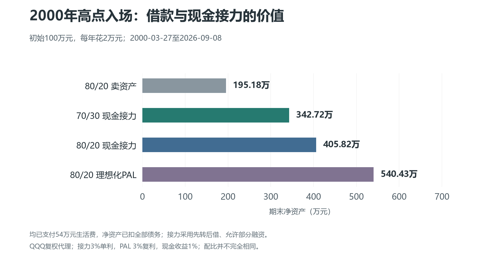
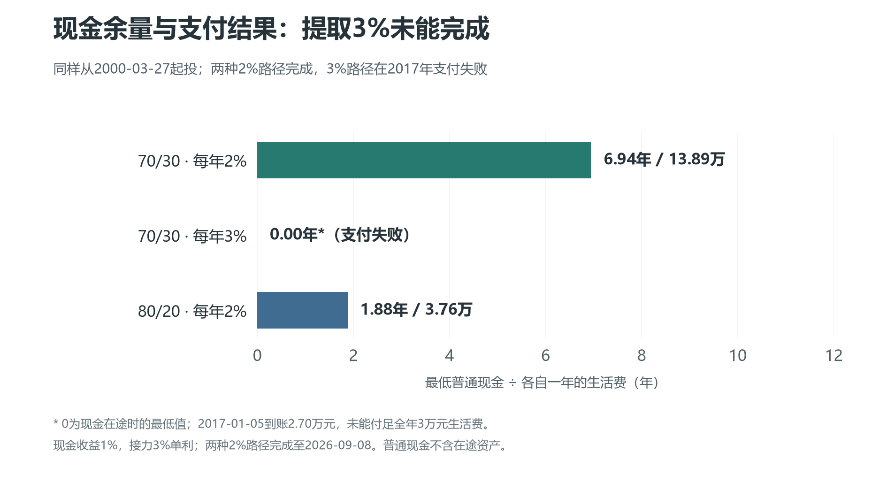
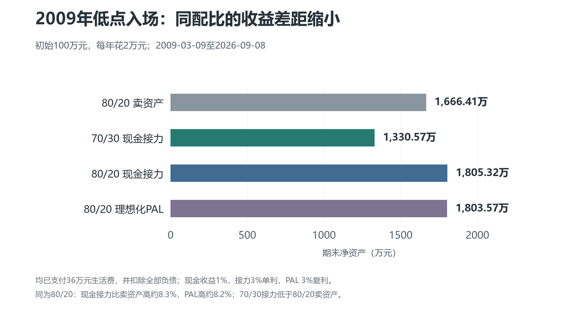

1.现金接力到底是怎么操作的？

这个策略的思路其实很简单：能借到钱的时候，就借钱生活；借不到钱的时候，就让事先准备好的现金接上。等市场恢复，重新满足融资和担保品转出的条件后，再继续借钱生活。

但只说这几句话还不够。前面我们已经看到，现金如果只出不进，早晚还是会花完。所以现金接力除了准备一笔现金，还需要一套与之配合的再平衡规则。

我们先采用70/30的配置，每年花初始资产的2%。为了方便说明，接下来都假设初始资产是100万元，那么就是70万元纳指基金、30万元现金，每年生活费2万元。这里的2万元是固定金额，即使以后资产涨到200万元，也不会自动变成每年花4万元。

第一步，初始的70万元纳指基金全部放在信用账户，30万元现金留在普通账户一侧。这里的“普通账户现金”主要是为了和信用账户区分，不要求必须存在证券账户中，也可以放在银行等地方。但必须能在需要时及时取用，不能把暂时赎不回来的理财也当成随时可用的生活费。

第二步，每年需要生活费时，先看信用账户的维持率是否高于300%。如果高于，就按当前已有负债计算有多少自有担保品可以划出，用它来安排当年的融资生活费，最多不超过2万元。

具体顺序是先将可划出的自有纳指基金转到普通账户，再在信用账户融资买回等额纳指基金，转出的基金到账后卖出生活。能转2万元就融资买回2万元，能转1万元就只融资买回1万元，其余1万元由普通账户现金补上。不要求必须一次借够全年生活费，否则一分钱都不借。

这里要区分“转出后”和“融资后”。担保品转出后，信用账户仍要满足300%；随后融资买回股票，维持率则允许低于300%。另外仍要有足够的可转出自有担保品和可用保证金，融资买入的持仓不能直接当成随时可转出的自有担保品。

举例，如果信用账户资产31万元，已有负债10万元，维持率310%，全年需要2万元。在其他额度足够的情况下，可以先转出1万元担保品，使维持率变成300%；随后融资买回1万元纳指，信用资产回到31万元，负债增加到11万元，维持率变成约281.82%。转出的1万元用于生活，另外1万元从普通现金里拿。

这也是这次回测采用的操作顺序。但实际执行前，要向券商确认转出审核发生在什么时点，后续融资是否会影响已经申请的划转。如果券商按照融资完成后的日终状态重新审核，就不能直接套用这组“先转后借”的结果。这里并不是说担保品转出本身可以无视300%的要求。

第三步，融资变现不够全年开销的部分，由普通现金补足。如果维持率不高于300%，或者没有可用额度，当年就完全不借，直接从普通现金中拿2万元生活。这不是永久停止融资，下一年重新检查，只要条件恢复，就可以继续融资套现。

第四步，每年集中做一次比例再平衡，尽量让股票和现金类资产恢复到70/30。但这里有一个非常重要的限制：现金少于初始资产的30%，也就是30万元时，不再用现金补仓股票。

更准确地说，只有超过30万元的现金才能拿来补股票。如果剩下30.5万元，那么最多只能补0.5万元，不能为了恢复70/30而把剩余生活费一起投进去。

反过来，如果股票涨得多，已经超过当前总资产的70%，仍然可以卖出多出来的部分，补充普通账户现金。比如股票90万元、现金30万元，总资产120万元，70%的股票目标就是84万元，可以卖出6万元股票，把现金补到36万元。当然，划出股票也要满足300%等转出条件，允许转多少就转多少，不够就接受暂时没有完全恢复比例。

这就是现金能够重新补回来的原因：市场不好时，先保住手里的生活费，不强行把它全部用来抄底；市场恢复后，再通过卖出超配的股票补充现金。

这里有两个细节一定要说清楚。70/30按股票和现金类资产的总市值计算，负债另外记录，并不是拿扣除负债后的净资产去乘70%。因此，有借款以后，即使总资产刚好恢复70/30，股票相对于净资产的比例也会高于70%，不能把它当成没有负债的普通70/30组合。另外，30万元是“禁止继续拿现金买股票”的底线，不是永远不能动的保险箱。生活费仍然可以从中支取，遇到信用风险时也可以拿去补担保。

正常的生活费安排和再平衡可以集中在每年相邻的几个交易日操作，顺序是先获取并支付当年的生活费，再做比例再平衡，实际要预留划转和卖出到账时间。维持率则需要平时持续监测，不能等到一年一次操作时才看。

我们依然把不主动偿还本金和利息作为目标，利息按单利长期挂账，未付利息不再计息。但未付利息也是负债，会降低维持率，不能因为暂时没付就当成不存在。至于能否持续挂息和展期，仍取决于具体券商合同和当时条件，不能把目前的确认理解成几十年不变的承诺。

所以，现金接力是一个折中方案。它会卖股票，也会在融资受限时花掉现金，并不是字面意义上永远不卖任何资产；它保留的是在条件允许时借款生活、尽量不还本付息的思路。

2.这样做，收益到底怎么样？

只讲方法不看结果没有意义。我们仍然从最难受的起点开始：2000年互联网泡沫高点附近入场，随后经历纳指大跌、漫长恢复，再遇到2008年金融危机。

先说明一下统一的回测条件，避免比较时各说各话。以下都是初始100万元，用QQQ复权行情作为纳指的历史代理，实际起点为2000年3月27日，终点为2026年9月8日。现金收益统一假设为每年1%，现金接力融资利率为3%，采用单利挂息。

对照的80/20卖资产，是初始80%纳指、20%现金，每年花2万元，并每年恢复80/20比例，不借钱。80/20质押则是每年借2万元生活，同样每年恢复80/20，利率3%，本金和利息都不还，利息并入本金继续计息。后面我把它简称为PAL。

这里的PAL是为了比较而设定的理想化模型，允许用整体组合担保、直接借出生活费，没有大陆融资的300%担保品转出限制，不能直接当成某一家实际产品的合同。

我也把80/20现金接力放进来一起比较，它与70/30版本的具体差别后面再说。最终结果是：80/20卖资产剩下195.18万元，70/30现金接力剩下342.72万元，80/20现金接力剩下405.82万元，80/20 PAL剩下540.43万元。

这些全部是净资产，也就是已经扣掉融资本金和所有未付利息后的数字，不是拿借来的钱一起充当收益。而且这四种配置都按每年2万元，支付了54万元生活费。回测起始年和最后一个未满的年度都按一整年预算支付，因此这里一共计入27次年度支出。

可以看到，70/30现金接力的期末净资产比80/20卖资产高了约75.6%。它的目标股票比例还更低，却在这个起点得到了明显更好的结果。同为80/20，现金接力则比卖资产高约107.9%。我认为这已经足以说明，这个折中方法有实际价值。

当然，它没有超过理想化的PAL。PAL在这个模型中可以更连续地借款生活，不必受到300%转出线的限制，因此保留下来了更多能参与后续上涨的资产。现金接力解决的是大陆融资业务中，如何在借钱受到限制的情况下继续安排生活费，并不意味着它能在收益上全面胜过直接质押。

从负债看，它们也不一样。70/30现金接力最后欠48.67万元，80/20现金接力欠53.38万元，PAL欠83.07万元。这也提醒我们，不能只盯着最后赚了多少，还要看一路承担了多少债务和风险。

3.为什么先选70/30，每年只提取2%？

看到这里，可能有人会问：前面说过，CLEC的70/30可以每年质押3%，为什么到了现金接力却只按2%来算？是不是过于保守？

要回答这个问题，我觉得最好把三种配置放在一起看：70/30每年提取2%，80/20每年提取2%，以及70/30每年提取3%。前两个比较的是股票比例，后一个比较的是生活费水平，不能把它们混成同一个问题。

下面仍然假设初始100万元，现金收益1%，融资利率3%，单利挂息。采用先转后借、允许部分融资、先生活费后再平衡的规则，160%触发补担保至200%。数据直接取自[现金接力：部分融资规则更新](../../reports/现金接力_部分融资规则更新.md)。

先看2000年3月27日高点入场的完整结果。金额单位为万元，净资产已经扣除全部本金和未付利息。

| 对比项目 | 70/30接力，每年2% | 80/20接力，每年2% | 70/30接力，每年3% |
| --- | --- | --- | --- |
| 每年生活费 | 2.00 | 2.00 | 3.00 |
| 实际运行至 | 2026-09-08 | 2026-09-08 | 2017-01-05 |
| 结果 | 完成 | 完成 | 生活费支付失败 |
| 期末或终止时净资产 | 342.72 | 405.82 | 55.65（终止时） |
| 期末或终止时负债 | 48.67 | 53.38 | 26.88（终止时） |
| 累计已付生活费 | 54.00 | 54.00 | 51.00 |
| 最低普通现金 | 13.89 | 3.76 | 0.00* |
| 最低现金相当于几年开销 | 6.94年 | 1.88年 | 0.00年* |
| 最低信用维持率 | 147.43% | 148.03% | 156.09% |
| 累计转入现金类资产补担保 | 6.08 | 6.79 | 8.59 |

这里先把两个容易误读的地方说清楚。3%版本的55.65万元是2017年停止测试当天的净资产，不是2026年的期末结果，所以不能拿这三个数直接排名投资收益。它每年花的钱也更多，虽然运行时间较短，已经支付的生活费却有51万元。

另外，表中带星号的0，是现金已经转成在途资金、尚未到账时的最低普通现金记录。失败日实际到账约2.70万元，只是不够全年3万元预算，并不是账户里一分钱都没有。

如果只比较两个每年花2万元的配置，80/20最终比70/30多留下约63.10万元净资产，高约18.4%。但它在最紧张的时候，普通现金只能覆盖1.88年开销，而70/30还有6.94年。这就是我希望大家看到的取舍：多配10%的股票，确实可能提高长期收益，也会明显减少普通账户的生活费余量。

80/20的执行规则也要相应调整：初始普通现金20万元，只有高于20万元的部分才能拿去补股票，股票超过当前总资产的80%时，按转出条件卖出超配部分。70/30的买股现金底线仍是30万元；如果每年花3万元，这30万元就只相当于10年开销，而不是2%版本的15年。生活费和补担保都可以动用底线以内的现金。

再看这些年到底有多少生活费靠借，多少需要现金接力。

| 年度融资决策 | 70/30接力，每年2% | 80/20接力，每年2% | 70/30接力，每年3% |
| --- | --- | --- | --- |
| 全额融资年份 | 18年 | 19年 | 7年 |
| 部分融资年份 | 0年 | 1年 | 1年 |
| 完全不融资、计划靠现金的年份 | 9年 | 7年 | 10年 |
| 已付足全年生活费的年份 | 27年 | 27年 | 17年 |

3%版本的融资决策统计包含2017年，但当年生活费没有付足，所以不能把“7＋1＋10＝18次决策”当成成功生活了18年。它唯一一次部分融资，恰好发生在最后失败的那一年。

具体来说，2017年开始操作时，信用账户维持率约302.55%，只能划转并融资6,683.48元。转出的股票次日卖得6,705.89元，连同原有现金，支出日一共有26,968.68元，距离3万元预算还差3,031.32元。此时维持率已降到297.04%，可继续转出的自有担保品额度为0，缺口就没法按原规则补上。

这时信用账户还有约79.83万元股票，净资产约55.65万元，却还是付不齐全年生活费。前面说的“账户里有资产，但没有足够的钱花”，就在这里真实地出现在了回测中。它没有触及140%的研究停止线，失败的是生活现金流。

还有一个很有意思的细节：3%版本的最低维持率156.09%，反而高于两个2%版本，但最后先出现支付失败的也是它。它累计拿了8.59万元现金类资产补担保，超过另外两个版本。补担保能帮助维持信用账户的比例，却会减少普通账户的可用现金，所以不能只挑一个最低维持率，来判断哪个策略更安全。

当然，只有2000年这一个起点也不够。我还检查了每个季度首个交易日入场、分别持有十年和二十年的历史窗口。

| 滚动回测 | 70/30接力，每年2% | 80/20接力，每年2% | 70/30接力，每年3% |
| --- | --- | --- | --- |
| 十年窗口完成数／总数 | 71／71 | 71／71 | 71／71 |
| 二十年窗口完成数／总数 | 31／31 | 31／31 | 30／31 |
| 二十年窗口中的最低普通现金／年开销 | 7.69年 | 2.64年 | 0.00年* |

3%版本失败的二十年窗口，是2000年4月3日起投，在2012年1月5日发生支付失败。它与前面3月27日起投、2017年失败的主路径不是同一条，不能混成一个日期。这里的0同样不包含在途资产。这些窗口也相互重叠，不能把1／31解释成未来失败概率，更不能把两个2%版本的全部完成理解成未来绝对安全。

历史回测之外，我还想知道：如果现金少赚一点、利息贵一点，或者跌得再深一点，会怎么样？下面这些压力结果，也采用同一套操作规则；未特别说明的参数，仍然是现金1%、融资3%。

| 压力情景 | 70/30接力，每年2% | 80/20接力，每年2% | 70/30接力，每年3% |
| --- | --- | --- | --- |
| 现金收益降到0% | 完成 | 完成 | 2010-01-06支付失败 |
| 融资利率升到6% | 完成 | 完成 | 2010-01-06支付失败 |
| 生活费每年增加2% | 完成 | 完成 | 2010-01-06支付失败 |
| 2008年低位再额外永久下跌20% | 完成 | 2010-01-06支付失败 | 2011-01-05支付失败 |
| 人工设定股票横盘40年 | 2027-01-05支付失败 | 2022-01-05支付失败 | 2018-01-03支付失败 |
| 融资4%＋现金0%＋生活费年增2%＋股票每年额外损耗1% | 完成 | 2011-01-05支付失败 | 2009-01-06支付失败 |

历史行情压力情景中，“完成”指运行到2026年9月8日；人工横盘则是单独构造的四十年路径。所有“支付失败”都指计划日无法付足整年的生活费，不等于账户资产归零。不同情景是分别测试，不能把某一行的结果套用到另一行，也不能把这些人工情景当成未来概率。

这张表对我判断80/20很有帮助。它在原历史主路径里通过了，但遇到2008年低位再额外跌20%的情景，就会出现现金流问题；70/30每年2%则完成了这一情景。相比之下，70/30每年3%对现金收益、融资成本和开销增长都更敏感，不能只看到它每年能多花1万元。

同时，70/30每年2%也有自己的边界。股票长期横盘的人工路径中，它同样会在2027年出现支付失败。更充足的现金储备可以延长应对时间，却不能让一个持续支出、负债累积的组合永远不需要资产增长。

因此，我目前仍然把70/30每年2%作为基础版本：它的期末收益低于80/20，但在这组测试中保留了更多普通现金，也完成了更多不利情景。80/20每年2%可以作为更激进的备选，不过最低现金不足两年开销，不能仅凭历史通过就说安全余量很高。70/30每年3%则没有通过当前参数下的高点主回测，我不把它列为默认可执行方案。

这里的2%是目前在生活费水平、股票仓位和现金余量之间，我认为比较合理的选择，并不是一个数学上绝对安全的数字。基础回测的生活费固定为每年2万元，并没有自动抵消几十年的通胀；如果希望开销逐年增长，应该看对应的支出压力测试，不能直接沿用固定开销的结果。

4.如果信用账户的维持率继续下降，怎么办？

还有一个问题不能漏掉。暂停融资，只是停止增加新的借款，并不会消除旧借款。市场继续下跌，信用账户仍然可能逼近风险线。

因此，我给现金接力增加了一条应急规则：当信用账户维持率低于160%时，优先把普通账户的一部分现金转换为合格的现金类担保证券，补进信用账户，目标是把维持率提高到200%。

先明确一点：在现金收益1%、融资利率3%、先转后借并允许部分融资的这次回测中，70/30、每年提取2%、2000年高点入场，也确实触发了补担保，发生在2008年，累计补入约6.08万元。前面提到的80/20以及70/30提取3%，同样用到了它。因此，这条规则是本次回测实际执行过的风险处理环节，不能只当成从未用过的备用条款。

70/30提取2%的最低维持率约147.43%，说明即使设定160%触发，也不能假设维持率永远停留在160%以上。价格会继续波动，担保品划转也需要时间，所以现金储备和应急执行都不能省略。

提高维持率，主要有三种方法。

第一种，拿普通账户现金补担保。比如信用账户资产15万元、负债10万元，维持率是150%。补入5万元现金类担保证券，资产增加到20万元，负债仍然10万元，维持率就提高到200%了。

这也是我最优先选择的方法，因为它不用偿还原来的本金和利息，保留了长期挂息的安排。但这里我倾向于转入合格的现金类证券，而不是让现金直接留在信用账户，以免现金被自动用于付息。具体产品是否能作为担保品、折算率多少、是否分红、到账时间如何，都要事先确认；“现金类”也不代表完全没有价格波动。

第二种，拿普通账户现金直接还款。同样是资产15万元、负债10万元，直接还2.5万元，信用账户资产仍然15万元，负债降到7.5万元，维持率也能达到200%。

可以看到，在这个例子中，直接还款比补担保更节省普通账户现金。但它违背了我们尽量不还款的初衷，所以我把它排在后面。如果真到了必须保住账户和生活安排的时候，也不能为了坚持一分钱不还而拒绝处理风险。

第三种，在信用账户卖券还款。仍然用这个例子，卖掉5万元证券并用来还债，账户资产降到10万元，负债降到5万元，维持率也变成200%。它不动用普通账户现金，但会减少股票持仓，也实际偿还了债务，我把它作为最后的备选。

这三种方法的效率不能简单排成固定顺序。普通现金直接还款，减少的是分母；补担保，增加的是分子；卖券还款，则同时减少分子和分母。前两者比较，直接还款通常更省现金，但补担保和卖券还款谁更有效，还要看当时的维持率和操作金额。

我的执行优先级仍然是：先补担保，再考虑现金还款，最后考虑卖券还款。为了补担保，可以动用那30万元底线以内的现金；只是这些钱一旦进入信用账户，就不能再同时当成普通账户中随时可花的生活费。

当前主回测模拟的是优先补担保、不主动还本付息的版本。后两种是应急处理办法，不能说主回测已经验证了所有还款后的路径。

160%也不是一道能挡住所有风险的墙。行情可能跳跌，担保品划转也需要时间，未必能在刚跌破160%的瞬间补到200%。即使补担保成功，也只是把资产从普通一侧搬到了信用一侧，没有凭空增加总资产，还可能压缩剩余的生活费储备。所以这条规则是增加应对能力，并不意味着所有比历史主路径更差的情况也能通过。140%在这里是研究停止线，也不是对所有券商实际强平标准的统一认定。

5.如果一开始就是好行情，还有必要借钱吗？

前面一直从2000年高点开始，是为了观察退休后立刻遇到大跌会怎么样。但如果运气很好，刚好在2009年低点附近入场，借款生活还能比卖资产好很多吗？

我们把起点改成2009年3月9日，终点仍然是2026年9月8日，其他条件保持一致。这段时间一共支付18次年度生活费，也就是36万元。

结果是：80/20卖资产最后剩下1666.41万元，70/30现金接力剩下1330.57万元，80/20现金接力剩下1805.32万元，80/20 PAL剩下1803.57万元。

先说一个不能回避的结果：70/30现金接力在这里没有赢过80/20卖资产。长期上涨时，少配10%的股票确实会少赚很多，借款生活带来的帮助并没有抵消这个差距。

为了减少股票比例不同的干扰，我们再看同为80/20的结果。在这个起点，80/20现金接力比卖资产的期末净资产高约8.3%，PAL高约8.2%，有优势，但已经没有2000年起点那么夸张。

作为对照，2000年起点下，同为80/20，现金接力比卖资产高约107.9%，PAL高约176.9%。这里比较的都是各自同一起点、同一终点下的相对差距，并不是拿两个不同时长的最终金额直接比收益率。

为什么会这样？

因为好行情里，资产很快涨起来，固定2万元生活费占当前资产的比例会越来越小。卖一点资产生活，对剩余持仓的影响已经不大，而借钱还要支付利息。所以即使借款最后更占优势，差距也未必特别大。

真正难受的是一退休就碰上漫长下跌。此时每卖出一笔资产来生活，都会减少未来能参与恢复的持仓。现金接力通过先融资、融资受限后使用预留现金，并限制现金不足时继续补股票，改变了这段困难时期的支出方式。它的价值，在2000年这样的不利起点中表现得尤其明显。

但这不意味着行情越差，借钱就一定越有利。债务会累积，现金也可能耗尽；如果市场长期不恢复，或者融资条件发生变化，借款策略可能先遇到信用和现金流问题。我们能说的是，在这两条已经测试的历史路径中，借款生活相对卖资产的优势，主要体现在较差的退休起点。

因此，我看待现金接力的重点，并不是牛市里能不能再多赚一点，而是能否用一套可执行的规则，帮助我们熬过退休初期最难受的那段行情。70/30每年2%给出的，是更多现金余量；80/20每年2%给出的，是更高股票仓位和更好的上涨参与度。选哪个，要看自己愿意用多少安全余量去换取收益。

这也是我愿意把这个折中方法完整写出来的原因。它没有消除融资的风险，也没有完全实现永远不卖资产，但至少给出了一个具体的方法，把“靠借钱生活”和“必要时用自己的现金生活”接了起来。对于希望在大陆尝试这一思路的人，我认为它值得认真理解和进一步研究。

文中回测说明：正文与三张配图已统一为2026年9月15日的最新参数：现金收益1%，接力融资3%单利，PAL为3%复利；接力采用先转后借、允许部分融资、先生活费后再平衡。使用QQQ复权日线代理，并非159501、513100、159696三只境内基金的人民币实盘回测；没有计入汇率、ETF溢折价、实际税费和理财赎回限制。融资保证金模型使用股票折算率70%、现金类证券90%，不是对某只基金当前折算率的确认。这些利率都是研究假设，改变后需要重新计算，不能直接沿用原来的结果。

本文中的PAL特指“3%复利、本息不付、年度80/20再平衡”的对照设定。现实证券担保贷款可能要求按月付息，利率和追加担保条件也会变化，不等于这个理想化模型。[FINRA的证券担保授信介绍](https://www.finra.org/investors/insights/securities-backed-lines-credit)对这些差异有具体说明。

数据依据：[现金接力部分融资规则更新及逐年账](../../reports/现金接力_部分融资规则更新.md)。旧版阶段报告与3%专项报告作为历史对照保留，不能与本次接力数字混用。担保品转出约束参见[上交所现行细则第44条](https://www.sse.com.cn/lawandrules/sselawsrules2025/trade/specific/margin/c/c_20250616_10782015.shtml)；本次假设转出资格不会被后续融资后的日终状态重新否决，具体仍须按券商的划转审核时点确认。
