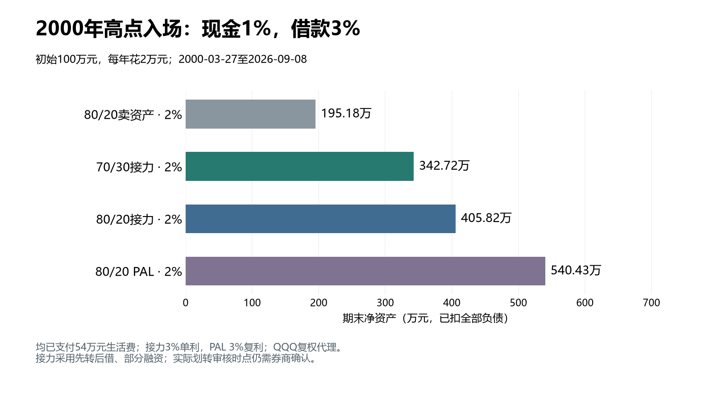

# 现金接力：部分融资规则更新（现金1%、融资3%）

2026-09-15更新。数据截止2026-09-08。本报告和所链接逐年账均已按现金收益1%、接力融资3%单利重新计算；PAL为3%复利。先前现金2%/融资2.8%的结果单列作参数对照。

## 本次结论

2000年高点起投，70/30提取2%和80/20提取2%完成；70/30提取3%在2017-01-05发生生活费支付失败。原来“3%通过但余量偏薄”的说法不适用于这组新利率。

两种2%配置的最低普通现金储备分别为6.94年和1.88年开销。不能沿用旧参数下8.31年和3.08年的安全余量。

## 固定规则与本次范围

初始100万元；70/30或80/20；年生活费为初始资产2%或3%，固定名义金额。现金（含现金类担保证券）年收益1%；接力融资3%单利挂息，不主动还本付息。PAL的3%仍为利息本金化的复利，两种计息方法不混同。

维持率高于300%时，先转出可用自有担保品，再融资买回等额股票，允许部分融资，不足生活费由普通现金补足；年度先获取并支付生活费，再做比例再平衡。转出按已有债务审核，融资买回后的维持率允许低于300%。

`融资额 = min(全年预算, max(0,信用资产−3×已有负债), 可转自有股票, max(0,保证金可用余额)/(股票折算率+融资保证金比例))`。已有负债包括未付利息。

70/30买股现金底线30万元、80/20为20万元；只限制再平衡买股，生活费及补担保仍可动用。维持率低于160%时，用现金类证券补担保至200%，允许用全部普通现金；140%是研究停止线。股票折算率70%、现金类90%、融资保证金比例100%，其他交易与交收规则不变。

本次重跑三种接力配置的五个历史起点、两个起点的卖资产/PAL对照、306个固定期限滚动窗口、24组压力情景和12组融资顺序对照。压力表中明确列出的0%现金、4%或6%融资利率属于敏感性覆盖，其余参数均从1%现金/3%融资基准出发。

实盘边界：先转后借仍是本研究的执行假设，未增加券商按后续融资后的日终状态重新否决划转的机制；具体审核时点需以券商为准。公开规则依据仍见[上交所细则](https://www.sse.com.cn/lawandrules/sselawsrules2025/trade/specific/margin/c/c_20250616_10782015.shtml)。

## 2000年高点：现金接力、卖资产、PAL同口径比较

起点2000-03-27，终点2026-09-08；下表四种策略均每年花初始资产2%，累计支付54万元。净资产已扣除全部本金和未付利息。卖资产和PAL每年恢复80/20，现金收益也统一为1%。

| 策略 | 状态 | 期末净资产/万元 | 期末负债/万元 | 最低维持率 | 累计补担保/万元 |
| --- | --- | --- | --- | --- | --- |
| 80/20卖资产 · 2% | 完成 | 195.18 | 0.00 | — | 0.00 |
| 70/30接力 · 2% | 完成 | 342.72 | 48.67 | 147.43% | 6.08 |
| 80/20接力 · 2% | 完成 | 405.82 | 53.38 | 148.03% | 6.79 |
| 80/20 PAL · 2% | 完成 | 540.43 | 83.07 | 148.12% | 0.00 |

相对80/20卖资产，70/30接力期末净资产高75.6%，80/20接力高107.9%，PAL高176.9%。70/30与80/20目标股票配比不同，不能把差额全部归因于借款方式。PAL是整体组合直接担保借出现金的理想化对照，不受大陆担保品转出300%约束。

## 三种接力配置的现金余量和参数变化

| 配置 | 新状态 | 旧参数期末净资产/万 | 新参数期末或终止净资产/万 | 最低普通现金/年开销 | 最低维持率 | 累计补担保/万 |
| --- | --- | --- | --- | --- | --- | --- |
| 70/30接力 · 2% | 完成 | 379.01 | 342.72 | 6.94 | 147.43% | 6.08 |
| 80/20接力 · 2% | 完成 | 434.48 | 405.82 | 1.88 | 148.03% | 6.79 |
| 70/30接力 · 3% | 支付失败 2017-01-05 | 325.58 | 55.65 | 0.00 | 156.09% | 8.59 |

旧参数指同样先转后借/部分融资，但现金2%、融资2.8%。失败配置的资产为终止当天余额，不能当作2026年期末值，也不能与完整期限直接比较收益。

| 配置 | 全额融资年 | 部分融资年 | 纯现金决策年 | 累计已付生活费/万 |
| --- | --- | --- | --- | --- |
| 70/30接力 · 2% | 18 | 0 | 9 | 54.00 |
| 80/20接力 · 2% | 19 | 1 | 7 | 54.00 |
| 70/30接力 · 3% | 7 | 1 | 10 | 51.00 |

融资年份统计包含最终失败年度的融资决策，不表示该年预算已支付；逐年账另列实际已付生活费。最低普通现金不含在途资产，因此出现0并不代表所有可变现资产归零。

## 70/30提取3%：失败当天发生了什么

2017年1月3日，信用账户维持率约302.55%，按新规则划转并融资约6,683.48元；转出股票次日卖得约6,705.89元。连同原普通现金，支出日可用现金共26,968.68元，距离3万元全年预算仍差3,031.32元。

2017年1月5日维持率约297.04%，低于300%，可转自有股票额度为0。此时仍有约79.83万元信用股票，净资产约55.65万元，问题是按当前规则无法释放足够现金支付全年预算。已经支付2000—2016年的51万元；2017年整年预算未支付。

最低普通现金记录为0，发生在1月4日现金已转为在途待到账时；1月5日到账现金为上述2.70万元，不能把“0年现金”解读为失败日一分钱都没有。

这属于当前年度支付规则下的流动性失败，不是净资产归零，也未触及140%研究停止线。失败日先调仓也无法凭空解除300%转出限制；改成更早准备现金、分月支出、还款救险或修改既往融资路径，属于另外的策略分支。

## 2009年低点起投

| 策略 | 状态 | 期末净资产/万 | 期末负债/万 | 累计生活费/万 |
| --- | --- | --- | --- | --- |
| 80/20卖资产 · 2% | 完成 | 1,666.41 | 0.00 | 36.00 |
| 70/30接力 · 2% | 完成 | 1,330.57 | 45.91 | 36.00 |
| 80/20接力 · 2% | 完成 | 1,805.32 | 45.91 | 36.00 |
| 80/20 PAL · 2% | 完成 | 1,803.57 | 47.77 | 36.00 |
| 70/30接力 · 3% | 完成 | 1,307.87 | 68.87 | 54.00 |

2009起点同为80/20时，接力比卖资产高8.3%，PAL高8.2%；70/30接力仍低于80/20卖资产。3%版本支付54万元，其他四个2%版本支付36万元，跨开销比较需区分。

## 其他历史起点

| 起点 | 配置 | 状态 | 期末或终止净资产/万 | 最低现金/年开销 |
| --- | --- | --- | --- | --- |
| 2007-10-31 | 70/30接力 · 2% | 完成 | 736.30 | 14.99 |
| 2020-02-19 | 70/30接力 · 2% | 完成 | 225.57 | 15.00 |
| 2021-11-19 | 70/30接力 · 2% | 完成 | 143.97 | 15.00 |
| 2007-10-31 | 80/20接力 · 2% | 完成 | 938.10 | 9.99 |
| 2020-02-19 | 80/20接力 · 2% | 完成 | 249.36 | 10.00 |
| 2021-11-19 | 80/20接力 · 2% | 完成 | 152.35 | 10.00 |
| 2007-10-31 | 70/30接力 · 3% | 完成 | 710.50 | 9.99 |
| 2020-02-19 | 70/30接力 · 3% | 完成 | 217.73 | 10.00 |
| 2021-11-19 | 70/30接力 · 3% | 完成 | 137.40 | 10.00 |

## 10年/20年滚动窗口

| 配置 | 年限 | 窗口数 | 失败数 | 最低维持率 | 最低普通现金/年开销 |
| --- | --- | --- | --- | --- | --- |
| 70/30接力 · 2% | 10 | 71 | 0 | 152.45% | 7.76 |
| 70/30接力 · 2% | 20 | 31 | 0 | 152.45% | 7.69 |
| 80/20接力 · 2% | 10 | 71 | 0 | 152.73% | 2.64 |
| 80/20接力 · 2% | 20 | 31 | 0 | 152.73% | 2.64 |
| 70/30接力 · 3% | 10 | 71 | 0 | 151.60% | 1.56 |
| 70/30接力 · 3% | 20 | 31 | 1 | 151.60% | 0.00 |

起点为季度首个可用交易日；窗口相互重叠，不是独立样本，历史失败占比不是未来失败概率。2000-03-27主路径与季度首日的起点不同，不应以滚动窗口取代高点主路径。

| 失败配置 | 起点 | 年限 | 终止日期 | 类型 |
| --- | --- | --- | --- | --- |
| 70/30接力 · 3% | 2000-04-03 | 20 | 2012-01-05 | LiquidityFailure |

## 压力测试（除明确覆盖项外均为现金1%、融资3%）

| 情景 | 70/30接力 · 2% | 80/20接力 · 2% | 70/30接力 · 3% |
| --- | --- | --- | --- |
| 现金0%（融资3%） | 完成 | 完成 | 支付失败 2010-01-06 |
| 融资4%（现金1%） | 完成 | 完成 | 支付失败 2010-01-06 |
| 融资6%（现金1%） | 完成 | 完成 | 支付失败 2010-01-06 |
| 生活费年增2% | 完成 | 完成 | 支付失败 2010-01-06 |
| 2008低位额外永久跌20% | 完成 | 支付失败 2010-01-06 | 支付失败 2011-01-05 |
| 人工40年横盘 | 支付失败 2027-01-05 | 支付失败 2022-01-05 | 支付失败 2018-01-03 |
| 人工先10年每年跌5%，后30年每年涨5% | 支付失败 2026-01-05 | 支付失败 2019-01-03 | 支付失败 2016-01-05 |
| 融资4%+现金0%+开销年增2%+股票年损耗1% | 完成 | 支付失败 2011-01-05 | 支付失败 2009-01-06 |

失败类型按模型原样报告。支付失败仅表示当日无法支付整年预算；维持率失败是触及140%的研究停止线。压力路径是人为情景，不代表未来概率；完整失败余额、可转额度和现金缺口见结果目录的 failure_diagnostics.json。

## 融资操作顺序对照（同为现金1%、融资3%）

下表全部从2000-03-27开始，先付生活费再再平衡不变。仅对照全额或零融资、部分融资但完成后仍300%、部分融资先转后借。失败时余额不与2026年终值作收益排名。

| 配置 | 融资规则 | 状态 | 期末或终止净资产/万 | 最低现金/年开销 |
| --- | --- | --- | --- | --- |
| 70/30接力 · 2% | 全额或零，完成后300% | 完成 | 315.33 | 7.13 |
| 70/30接力 · 2% | 部分融资，完成后300% | 完成 | 333.53 | 7.34 |
| 70/30接力 · 2% | 部分融资，先转后借 | 完成 | 342.72 | 6.94 |
| 80/20接力 · 2% | 全额或零，完成后300% | 完成 | 380.67 | 2.76 |
| 80/20接力 · 2% | 部分融资，完成后300% | 完成 | 398.49 | 2.29 |
| 80/20接力 · 2% | 部分融资，先转后借 | 完成 | 405.82 | 1.88 |
| 70/30接力 · 3% | 全额或零，完成后300% | 完成 | 204.08 | 0.01 |
| 70/30接力 · 3% | 部分融资，完成后300% | 完成 | 286.53 | 0.37 |
| 70/30接力 · 3% | 部分融资，先转后借 | 支付失败 2017-01-05 | 55.65 | 0.00 |

## 逐年双账户账与验证

- [70/30接力 · 2%逐年账](现金接力部分融资_逐年账_relay70.md)

- [80/20接力 · 2%逐年账](现金接力部分融资_逐年账_relay80.md)

- [70/30接力 · 3%逐年账](现金接力部分融资_逐年账_relay70_w3.md)

所有主路径核对逐年损益、双账户资产负债恒等式、零还款、融资及转出限额、生活费先于再平衡。失败路径终止年度未付款不计入累计生活费。

复现：`python scripts/run_partial_living_rates.py`；生成本报告：`python scripts/build_partial_living_rates_report.py`。数据目录：`results/partial_living_cash1_rate3/`。原参数数据仍在 `results/partial_living/`；报告更新前备份在 `tmp/partial_living_before_rate_update/`。

本文为QQQ复权代理回测，不是境内ETF人民币实盘结果；未计汇率、溢折价、税费、实际合同变动和理财赎回限制。现金1%与融资3%是本次指定研究参数，不是市场报价。
